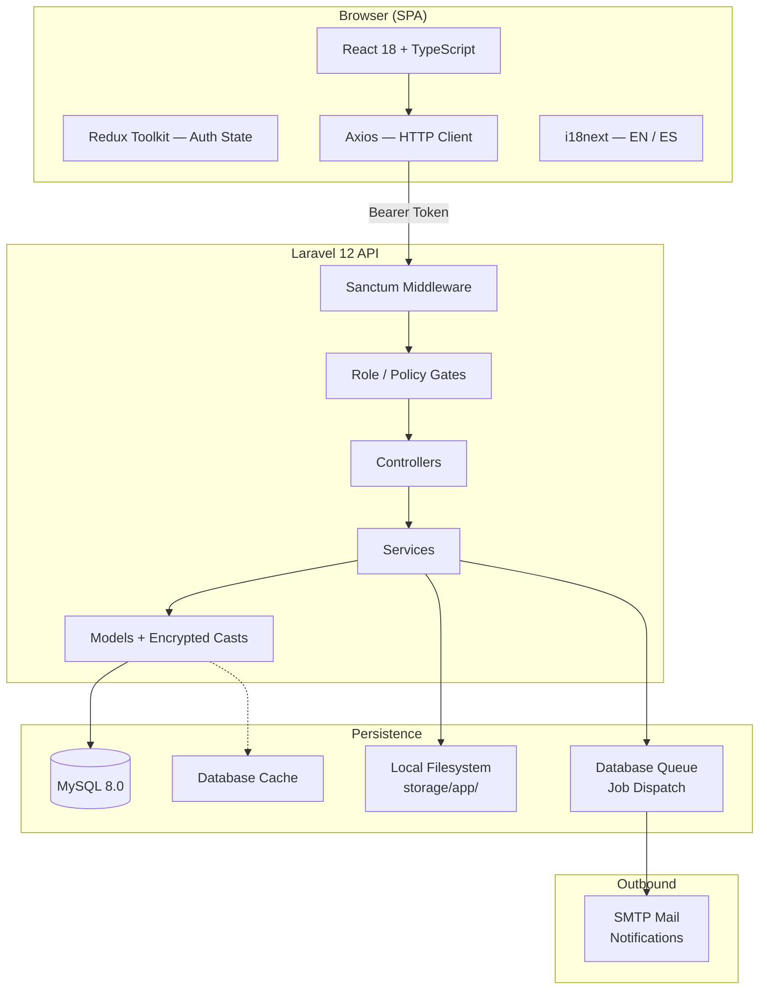
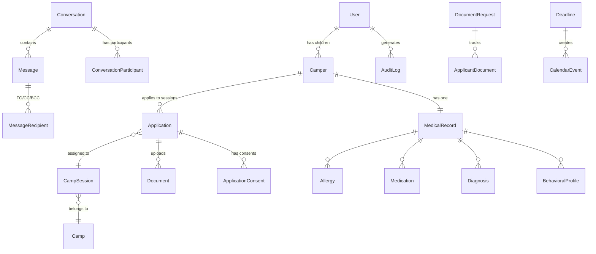

# Camp Burnt Gin

Camp Burnt Gin is a full-stack, HIPAA-conscious camp management platform built for the Children and Youth with Special Health Care Needs (CYSHCN) program. It replaces paper and email-based workflows with a structured, auditable, role-based web application that covers the complete lifecycle of a camp enrollment: application submission, medical record management, application review and approval, document compliance, internal communications, and post-approval operations. Four distinct user portals serve applicants (parents and guardians), camp administrators, medical staff, and system owners.

---

## Table of Contents

1. [Executive Overview](#1-executive-overview)
2. [Core Capabilities](#2-core-capabilities)
3. [User Roles and Access Model](#3-user-roles-and-access-model)
4. [System Architecture](#4-system-architecture)
5. [Major Workflows](#5-major-workflows)
6. [Data Model](#6-data-model)
7. [Repository Structure](#7-repository-structure)
8. [Technology Stack](#8-technology-stack)
9. [Setup and Installation](#9-setup-and-installation)
10. [Environment Configuration](#10-environment-configuration)
11. [Running the System](#11-running-the-system)
12. [Testing](#12-testing)
13. [Implementation Notes](#13-implementation-notes)
14. [Security and Compliance](#14-security-and-compliance)
15. [Development Guidance](#15-development-guidance)
16. [Reference Documentation](#16-reference-documentation)

---

## 1. Executive Overview

Camp Burnt Gin serves families of children and youth with complex medical and developmental needs who wish to enroll in a structured therapeutic camp program. Before this system, enrollment was handled through paper forms mailed back and forth, medical records kept in file cabinets, and administrative review conducted over email. This platform centralizes and secures every step of that process.

The system is built around three core concerns:

- **Enrollment integrity:** Applications flow through a defined, enforced state machine. Approval requires capacity checks, document compliance verification, and an authorized reviewer. Every status change is recorded.
- **Medical data protection:** Personally identifiable health information (PHI) is encrypted at rest using Laravel's encrypted cast, accessed only by authorized roles, and logged to a tamper-evident audit trail on every read.
- **Operational clarity:** Administrators can manage camp sessions with capacity enforcement and waitlist promotion, issue and track document requests, generate mailing and ID-label reports, communicate through a threaded inbox, and publish announcements and deadlines to all users.

The platform is implemented as a Laravel 12 REST API consumed by a React 18 TypeScript single-page application. Both layers are fully operational across all four portals. The backend has 95 database migrations, 51 controllers, 42 models, and more than 380 passing integration and unit tests.

---

## 2. Core Capabilities

### Application Management

The applicant portal guides a parent or guardian through a multi-section digital application form. The form auto-saves as a draft, supports save-and-resume, and captures biographical information, emergency contacts, behavioral profile data, session preferences, narrative responses, and a digital signature. Applications are tied to a specific camp session and can be re-applied from across years with pre-populated biographical fields.

A second application path supports Spanish-speaking families through full i18n coverage. All user-facing strings are served via i18next; English and Spanish translations are kept in parity.

Once submitted, applications pass through an enforced status machine managed by `ApplicationService`. Status transitions are validated by `ApplicationStatus::canTransitionTo()`. Approval activates the camper record and their medical record. Reversal deactivates them, with care taken to preserve activation if the camper has another approved application in a different session.

### Medical Records

The medical portal provides read/write access to a comprehensive health profile for each enrolled camper. Medical data is organized across multiple related tables: allergies with severity tiers, current medications with dosage and frequency, diagnoses with ICD codes, behavioral risk assessments, feeding plans, assistive device records, activity permissions, and personal care plans covering toileting, dressing, feeding, mobility, and hygiene.

During camp operations, medical staff can log treatment interventions, record medical station visits with disposition, document incidents with severity classification, create follow-up tasks with priority and deadline, and place activity restrictions. Each of these actions is policy-gated and audit-logged.

An emergency snapshot view (`MedicalEmergencyViewPage`) presents critical information (allergies, behavioral risks, medications, and emergency contacts) in a single-screen format designed for rapid reference during incidents.

External medical providers (physicians, specialists) can be granted time-limited, token-based read access to a specific camper's health record without requiring a full system account.

### Document Management

Documents are stored in a polymorphic system where any model (application, message) can own file attachments. Uploads are validated by MIME type and magic bytes before storage under `storage/app/documents/`.

Administrators can issue formal document requests to applicants with a deadline and reminder capability. Applicants see pending requests in their documents page and upload their submissions directly. Admins review and approve or reject each submission. A compliance engine (`DocumentEnforcementService`) checks required document rules against actual submission state and verification status before an application can be approved.

All uploaded files carry a verification status (unverified, approved, rejected). Admin staff verify documents; only approved documents count toward compliance requirements.

### Inbox and Messaging

The messaging system uses a threaded conversation model similar to Gmail. Conversations are containers; messages are immutable records within them. Each message supports TO, CC, and BCC recipients tracked individually in the `message_recipients` table.

Reply and reply-all operations are handled server-side: reply sends only to the original sender; reply-all sends to TO and CC recipients, excluding BCC recipients (who remain invisible to non-senders). File attachments are supported on messages and stored via the document system.

Per-user conversation state (starred, important, archived, trashed, read) is tracked separately from the conversation itself, enabling personal inbox organization without affecting other participants.

### Form Builder

Super administrators can create, version, and publish application form schemas via a visual form builder. Forms consist of sections, fields, and field options. Published schemas are consumed by the applicant portal to render the application form dynamically. Applications record which form version they were submitted against for historical fidelity.

### Session and Capacity Management

Administrators manage camp sessions with configurable capacity limits, age constraints, and enrollment tracking. The `ApplicationService` enforces capacity at the moment of approval: attempting to approve an application into a full session returns an error. When a session reaches capacity, excess applications can be placed in a waitlisted state. Archived sessions are preserved for historical access but hidden from active workflows.

### Reporting and Exports

The reports module generates several pre-defined outputs for administrative use: an application summary with status breakdown, accepted and rejected applicant lists, mailing labels formatted for printing on standard label stock, and ID labels that include allergy warnings and supervision level. The audit log can be exported up to 5,000 rows in CSV or JSON format, with filters for date range, user, action type, and PHI access flag.

### Announcements and Calendar

Administrators publish announcements visible to all roles. Announcements support pinning and archiving. A camp calendar displays events and application deadlines. Deadlines have an optional enforcement flag and auto-sync to calendar events. Session-specific bulk deadline creation is supported.

### User Management

Super administrators manage all non-applicant accounts: creating staff accounts (admin, medical, or additional super_admin), reassigning roles, and deactivating or reactivating users. The last active super_admin account cannot be deleted or demoted, preventing administrative lockout.

### Audit Logging

Every PHI read and every administrative action is written to the `audit_logs` table with the acting user's ID, IP address, user agent, the model and record affected, a before/after change snapshot, and a PHI flag. The audit log is browsable and exportable by super administrators.

---

## 3. User Roles and Access Model

| Role | Slug | Primary Responsibilities | Key Permissions | Important Restrictions |
|------|------|--------------------------|-----------------|------------------------|
| Applicant | `applicant` | Submit applications for their children; upload required documents; communicate with admins | Own campers and applications; own documents; inbox participation | Cannot read own medical records; cannot access other applicants' data |
| Administrator | `admin` | Review and process applications; manage sessions and campers; generate reports | All applications, campers, sessions, documents, reports, announcements, inbox | Cannot access user management, audit log, or form builder |
| Medical Staff | `medical` | Maintain medical records during pre-camp and camp operations | Read/write all medical records, treatment logs, incidents, follow-ups, visits; inbox | No access to applications, administrative functions, or reports |
| Super Administrator | `super_admin` | Govern the system; manage staff accounts; audit activity | All admin capabilities plus user management, audit log access, form builder | The last super_admin account cannot be deleted or demoted |

**Role inheritance:** `super_admin` passes all admin authorization checks via an `isAdmin()` override, giving full access to every admin-level route, controller, and policy method without duplication. Access is enforced at three independent layers: route middleware, controller-level `$this->authorize()` calls, and policy class methods.

---

## 4. System Architecture

### Layer Overview



### Backend Structure

The Laravel API follows a layered architecture. Controllers are thin: they validate the authenticated user's authorization, delegate to a service class, and return a JSON resource. Business logic lives exclusively in service classes. Models handle relationships, attribute casting (including field-level encryption), and scopes.

The `app/Http/Middleware` chain adds request ID generation, role enforcement, audit logging for PHI access, and security headers (HSTS, CSP, X-Frame-Options) to every response.

Notifications dispatch via Laravel's database notification channel. Email is sent via SMTP using notification classes that respect per-user `notification_preferences` flags.

### Frontend Structure

The React SPA is organized into domain feature modules under `src/features/`. Each feature module contains its own pages, components, API layer, Redux slice (if stateful), and TypeScript types. Shared UI primitives (tables, modals, form inputs, status badges, layout shells) live in `src/ui/`. Authentication state is the only globally shared Redux state; all other data is fetched and managed per-page.

All pages are lazy-loaded via `React.lazy` and wrapped in `Suspense`. Route guards enforce role-based access before any page component renders. The Axios client injects the bearer token from Redux state on every request and handles 401 responses by dispatching a logout event.

### Data Flow for a Protected Request

```
1. User action triggers an API call in a feature's *.api.ts module
2. Axios request interceptor injects Authorization: Bearer <token>
3. Laravel auth:sanctum middleware validates the token
4. EnsureUserHasRole or 'admin' gate checks role access
5. Controller calls $this->authorize() against the resource policy
6. If authorized: controller calls service → service reads/writes models
7. If PHI is accessed: AuditPhiAccess middleware writes audit_logs entry
8. Controller returns JSON resource → Axios → component state update
```

---

## 5. Major Workflows

### Account Creation and Authentication

1. New applicant registers via `POST /auth/register`. Account is created in an unverified state.
2. A verification email is dispatched. All protected routes require `email_verified_at` to be set.
3. Applicant clicks the verification link, which calls `POST /auth/email/verify`.
4. On login (`POST /auth/login`), if MFA is not enabled, the API returns a Sanctum token. The frontend stores the token in `sessionStorage['auth_token']` and loads it into Redux.
5. If MFA is enabled, the login response returns `{ mfa_required: true }` with no token. The login page transitions to a TOTP input step. The user submits the 6-digit code in a second POST request; the server validates via Google2FA and issues the token.
6. On every page load, `useAuthInit` reads the token from `sessionStorage`, calls `GET /user`, and restores Redux auth state.
7. A `useIdleTimeout` hook enforces a HIPAA-compliant inactivity logout after 60 minutes of no user interaction. Sanctum tokens have an absolute expiry of 8 hours.
8. Account lockout activates after 5 consecutive failed login attempts; the account is locked for 15 minutes.

### Application Creation and Submission

1. Applicant navigates to `/applicant/applications/start` and selects a camper or is prompted to create one.
2. The form page (`ApplicationFormPage`) creates a draft application via `POST /applications` on first load.
3. Progress is auto-saved to `localStorage` as `cbg_app_draft`. The "Continue Draft" flow reads this key to restore state.
4. The applicant completes all sections: camper biographical data, guardian and emergency contact information, session preference, behavioral profile, medical narrative, dietary needs, and seven consent acknowledgements.
5. On submit, all sections are written to the API sequentially. The final `POST /applications/:id/sign` call captures the digital signature (name + base64 canvas data) and marks `is_draft = false` and `submitted_at`.
6. The application enters `pending` status. The parent sees it listed in `/applicant/applications`.
7. For reapplications, `/applicant/applications/start` offers a re-apply path that pre-fills biographical fields from a prior application via `location.state.prefill`.

### Application Review and Approval

1. Admin views the application on `ApplicationReviewPage`. The page shows all submitted sections, a completeness checklist, the document compliance summary, and the current status.
2. Admin may edit sections inline (camper info, emergency contacts, behavioral profile, narrative responses) or upload documents on behalf of the applicant.
3. Admin submits a review decision via `POST /applications/:id/review` with `{ status, notes, overrideIncomplete? }`.
4. `ApplicationService::reviewApplication()` validates the transition via `ApplicationStatus::canTransitionTo()`. If approving:
   - Checks session capacity (rejects if full).
   - Checks document compliance (rejects unless `overrideIncomplete = true`).
5. All mutations run inside a `DB::transaction()`:
   - Application status, reviewed_at, reviewed_by, notes are updated.
   - On approval: camper `is_active` set to `true`; medical record `is_active` set to `true`.
   - On reversal of approval: camper and medical record deactivated, unless another active application exists.
   - `AuditLog::logAdminAction()` writes the change record.
6. After the transaction commits: status-change notification email is dispatched; a system inbox message is created for the applicant.

### Document Request Workflow

1. Admin creates a document request via `POST /document-requests` with document type, deadline, and applicant.
2. Applicant sees the pending request on `/applicant/documents` with a due date indicator.
3. Applicant uploads their document via `POST /applicant/document-requests/:id/upload`.
4. Admin verifies the submission (`PATCH /documents/:id/verify`) with status `approved` or `rejected`.
5. If rejected, the admin can re-open the request for resubmission via `PATCH /document-requests/:id/reupload`.
6. Approved documents count toward the application's compliance requirements checked by `DocumentEnforcementService`.

### Medical Record Workflow

1. Medical record is created at application submission (or on approval activation if not already present).
2. Medical staff access a camper's full record via `/medical/records/:camperId`.
3. Staff can add or update allergies, medications, diagnoses, behavioral profiles, feeding plans, assistive devices, activity permissions, and the personal care plan.
4. During camp operations, staff log treatment interventions, clinic visits, and medical incidents as they occur.
5. Follow-up tasks created from incidents appear in the `/medical/follow-ups` queue with priority and due date.
6. Every read of a medical record triggers the `AuditPhiAccess` middleware, writing a log entry with the reader's identity, IP, and timestamp.

### Messaging Workflow

1. Admin creates a conversation via `POST /inbox/conversations` with a participant list, title, and category.
2. Participants receive a system inbox notification.
3. Any participant sends a message via `POST /inbox/conversations/:id/messages`.
4. Reply targets only the original sender; reply-all targets TO and CC recipients, with BCC participants hidden from recipients.
5. An idempotency key on each message prevents duplicate sends on network retry.
6. Per-user state (read, starred, archived, trashed) is managed independently without affecting other participants' views.

---

## 6. Data Model

### Entity Relationship Summary



### Core Tables

| Table | Purpose | Notable Columns |
|-------|---------|-----------------|
| `users` | All accounts across all roles | `role_id`, `is_active`, `mfa_enabled`, `mfa_secret` (hidden), `failed_login_attempts`, `lockout_until` |
| `roles` | Role definitions | `name` (slug: super_admin, admin, medical, applicant) |
| `campers` | Children attending camp | `user_id`, `is_active`, soft-deletes |
| `camps` | Camp programs | `name`, `description` |
| `camp_sessions` | Individual session instances | `capacity`, `enrolled_count`, `start_date`, `end_date`, `min_age`, `max_age` |
| `cabins` | Cabin assignments | `camp_session_id`, `capacity` |
| `applications` | Enrollment applications | `status` (enum), `is_draft`, `is_incomplete_at_approval`, `submitted_at`, `signature_data` (hidden), `reapplied_from_id` |
| `application_consents` | Consent records per application | `consent_type` (enum), `is_agreed`, `agreed_at` |

### Medical Tables (PHI, all sensitive fields encrypted)

| Table | Purpose |
|-------|---------|
| `medical_records` | Root medical record per camper; physician, insurance, special needs |
| `allergies` | Substance, reaction, severity (mild → anaphylaxis) |
| `medications` | Name, dosage, frequency, indication |
| `diagnoses` | Diagnosis name, ICD code, severity |
| `behavioral_profiles` | Wandering risk, aggression risk, supervision level |
| `feeding_plans` | Feeding type, special diet, assistance level |
| `assistive_devices` | Device type, care instructions |
| `activity_permissions` | Per-activity clearance level |
| `emergency_contacts` | Per-camper emergency contact (separate from user-level) |
| `personal_care_plans` | ADL assistance levels (toileting, dressing, feeding, mobility, hygiene, bowel, bladder) |
| `treatment_logs` | Clinical interventions during camp; medication administration |
| `medical_visits` | Clinic visit records with disposition |
| `medical_incidents` | Injury and health events with severity classification |
| `medical_follow_ups` | Follow-up tasks from incidents with priority and status |
| `medical_restrictions` | Activity restrictions with dates and reason |

### Document and Messaging Tables

| Table | Purpose |
|-------|---------|
| `documents` | Polymorphic file records (application, message attachments); verification status |
| `document_requests` | Admin-issued upload requests to applicants |
| `applicant_documents` | Tracks original template + submitted document per request |
| `required_document_rules` | Rule engine definitions for compliance checking |
| `conversations` | Thread containers; category; per-user archive and pin state |
| `conversation_participants` | User membership with per-user state (starred, important, trashed, read) |
| `messages` | Immutable message records; parent_message_id for threading; soft-deletes |
| `message_recipients` | TO/CC/BCC recipient rows per message |
| `message_reads` | Read receipts (one per user per message) |

### Application Status State Machine

```
                      ┌──────────────────────────────────────┐
                      │                                      │
        pending  ──►  under_review  ──►  approved            │
           │               │               │                 │
           │               ▼               ▼                 │
           │           rejected       waitlisted             │
           │               │               │                 │
           └──► cancelled  └──► withdrawn  └──► approved     │
                                                             │
        All transitions validated by ApplicationStatus::canTransitionTo()
```

Valid transitions are enforced server-side. Invalid transition attempts return HTTP 422.

---

## 7. Repository Structure

```
Camp_Burnt_Gin_Project/
├── README.md                                    # This file
├── BUG_TRACKER.md                               # Active issue log
├── Application_Forms/                           # Official blank form PDFs
│   ├── CYSHCN Camper Application.pdf
│   ├── Children and Youth with SHCN.pdf
│   ├── Children and Youth with SHCN_Spanish.pdf
│   └── Medical_form.pdf
├── .github/
│   └── workflows/
│       ├── ci.yml                               # Tests, linting, type checking
│       ├── database.yml                         # Migration integrity checks
│       ├── deploy.yml                           # Production deployment
│       ├── rollback.yml                         # Deployment rollback
│       └── security.yml                         # Dependency vulnerability scanning
├── backend/
│   └── camp-burnt-gin-api/
│       ├── app/
│       │   ├── Enums/                           # ApplicationStatus, AllergySeverity, etc.
│       │   ├── Http/
│       │   │   ├── Controllers/                 # 51 controllers (auth, camp, medical, inbox, etc.)
│       │   │   ├── Middleware/                  # Auth, role enforcement, PHI audit, security headers
│       │   │   ├── Requests/                    # Form request validators (one per mutation)
│       │   │   └── Resources/                   # JSON API resources
│       │   ├── Models/                          # 42 Eloquent models
│       │   ├── Policies/                        # 30+ policy classes (one per model)
│       │   ├── Services/                        # Business logic (23 service classes)
│       │   ├── Events/ Listeners/ Jobs/         # Async operations and notifications
│       │   └── Notifications/                   # Email notification classes
│       ├── database/
│       │   ├── migrations/                      # 95 migration files (chronological)
│       │   └── seeders/                         # 37 seeder classes
│       ├── routes/
│       │   └── api.php                          # All API routes (~1,000 lines)
│       ├── tests/
│       │   ├── Feature/                         # Integration tests (API, auth, security, inbox)
│       │   └── Unit/                            # Service unit tests
│       └── .env.example                         # Environment variable template
├── frontend/
│   ├── FRONTEND_GUIDE.md                        # Canonical frontend developer reference
│   └── src/
│       ├── app/                                 # App entry, error boundary
│       ├── api/
│       │   └── axios.config.ts                  # Axios instance, token injection, 401 handling
│       ├── core/
│       │   └── routing/index.tsx                # Complete React Router tree
│       ├── features/
│       │   ├── admin/                           # Admin portal pages, API, types
│       │   ├── auth/                            # Login, register, MFA, password reset
│       │   ├── medical/                         # Medical portal pages and API
│       │   ├── messaging/                       # Inbox, conversations, compose
│       │   ├── parent/                          # Applicant portal pages and API
│       │   ├── profile/                         # Profile and settings pages
│       │   └── superadmin/                      # User management, audit log, form builder
│       ├── shared/
│       │   ├── constants/routes.ts              # Typed route path constants
│       │   ├── types/                           # Shared TypeScript interfaces
│       │   ├── hooks/                           # useAuthInit, useIdleTimeout, etc.
│       │   └── utils/                           # Date formatting, file helpers, etc.
│       ├── ui/                                  # Layout shells, shared components, StatusBadge
│       ├── assets/styles/
│       │   └── design-tokens.css                # CSS custom properties (color, spacing, typography)
│       └── i18n/
│           ├── en.json                          # English translations
│           └── es.json                          # Spanish translations (full parity)
└── docs/
    ├── INDEX.md                                 # Navigation index for all reference docs
    ├── architecture/                            # System design and architecture decisions
    ├── api/                                     # API endpoint reference
    ├── auth/                                    # Authentication flows and token lifecycle
    ├── roles-and-permissions/                   # RBAC design and permission matrix
    ├── database/                                # Schema overview and data model
    ├── backend/                                 # Backend implementation guides
    ├── frontend/                                # Frontend architecture guides
    ├── security/                                # Security controls and audit logging
    ├── features/                                # Feature-specific implementation guides
    ├── workflows/                               # Application lifecycle and business rules
    ├── testing/                                 # Test strategy and execution guide
    ├── deployment/                              # Setup, CI/CD, and production procedures
    ├── ui-ux/                                   # Design system and component guide
    ├── governance/                              # Contributing guidelines and code standards
    └── reports/                                 # Forensic audit reports
```

---

## 8. Technology Stack

### Backend

| Component | Technology |
|-----------|-----------|
| Framework | Laravel 12 |
| Language | PHP 8.2+ |
| Database | MySQL 8.0 |
| Authentication | Laravel Sanctum 4.2 (API tokens) |
| MFA | PragmaRx Google2FA 9.0 (TOTP) |
| Queue | Database driver (Laravel jobs) |
| Session | Database driver (30-minute lifetime, encrypted) |
| Testing | PHPUnit 11.5 |
| Static Analysis | Larastan 3.0 |
| Code Style | Laravel Pint |

### Frontend

| Component | Technology |
|-----------|-----------|
| Framework | React 18.3 |
| Language | TypeScript 5 (strict mode) |
| Build Tool | Vite 5 |
| Package Manager | pnpm |
| Styling | Tailwind CSS 3.4 |
| State Management | Redux Toolkit 2.11 + react-redux 9.2 |
| HTTP Client | Axios 1.13 |
| Routing | React Router 7.13 |
| Internationalization | i18next 25 + react-i18next 16 |
| Form Validation | Zod 3.25 |
| Animation | Framer Motion 12.35 |
| Rich Text Editor | Tiptap 3.20 |
| UI Primitives | Radix UI (accordion, dialog, select, dropdown) |
| Icons | Lucide React 0.487 |
| Charts | Recharts 3.8 |
| Testing | Vitest, React Testing Library, Playwright (E2E) |

### Infrastructure

| Component | Technology |
|-----------|-----------|
| CI/CD | GitHub Actions (5 workflows) |
| Container Support | Docker (PHP, MySQL, Mailhog, nginx) |
| Mail (development) | Mailhog (SMTP localhost:1025) |
| File Storage | Local filesystem (`storage/app/`) |

---

## 9. Setup and Installation

### Prerequisites

- PHP 8.2 or later
- Composer
- MySQL 8.0
- Node.js 20 or later
- pnpm (`npm install -g pnpm`)

### Clone the Repository

```bash
git clone <repository-url>
cd Camp_Burnt_Gin_Project
```

### Backend Setup

```bash
cd backend/camp-burnt-gin-api

# Install PHP dependencies
composer install

# Copy environment configuration
cp .env.example .env

# Generate application encryption key
php artisan key:generate

# Create the database
mysql -u root -p -e "CREATE DATABASE camp_burnt_gin CHARACTER SET utf8mb4 COLLATE utf8mb4_unicode_ci;"

# Configure database credentials in .env
# DB_HOST, DB_DATABASE, DB_USERNAME, DB_PASSWORD

# Run migrations
php artisan migrate

# Seed the database with demo data
php artisan db:seed

# Create the storage symlink for public file access
php artisan storage:link
```

> **Email verification in local development:** All protected routes require a verified email address. Set `MAIL_MAILER=log` in `.env` to capture verification emails in `storage/logs/laravel.log`. For Docker setups, Mailhog is available at `http://localhost:8025`.

Full setup instructions: [docs/deployment/Setup.md](docs/deployment/Setup.md)

### Frontend Setup

```bash
cd frontend

# Install JavaScript dependencies
pnpm install

# Copy environment configuration
cp .env.example .env.local
# .env.example sets VITE_API_BASE_URL=http://localhost:8000
# No edits required for the default local setup
```

Full frontend reference: [frontend/FRONTEND_GUIDE.md](frontend/FRONTEND_GUIDE.md)

---

## 10. Environment Configuration

### Backend (`.env`)

| Variable | Purpose | Default |
|----------|---------|---------|
| `APP_KEY` | Application encryption key (generated via `php artisan key:generate`) | — |
| `APP_ENV` | Environment context (`local`, `production`) | `local` |
| `APP_DEBUG` | Enable debug output (must be `false` in production) | `false` |
| `DB_CONNECTION` | Database driver | `mysql` |
| `DB_HOST` | Database host | `127.0.0.1` |
| `DB_DATABASE` | Database name | `camp_burnt_gin` |
| `DB_USERNAME` | Database user | — |
| `DB_PASSWORD` | Database password | — |
| `BCRYPT_ROUNDS` | Password hashing cost factor | `14` |
| `SANCTUM_EXPIRATION` | Token absolute lifetime in minutes | `480` (8 hours) |
| `SANCTUM_STATEFUL_DOMAINS` | Domains permitted for Sanctum cookie auth | `localhost:5173` |
| `SESSION_LIFETIME` | Server-side session lifetime in minutes | `30` |
| `SESSION_ENCRYPT` | Encrypt session data at rest | `true` |
| `SESSION_SECURE_COOKIE` | Require HTTPS for session cookie (set `true` in production) | `false` |
| `CORS_ALLOWED_ORIGINS` | Comma-separated allowed origins for CORS | `http://localhost:5173` |
| `MAIL_MAILER` | Mail driver (`smtp`, `log`, `mailhog`) | `smtp` |
| `MAIL_HOST` | SMTP host | `127.0.0.1` |
| `MAIL_PORT` | SMTP port | `1025` |
| `MAIL_FROM_ADDRESS` | From address for all outgoing email | `noreply@campburntgin.org` |
| `QUEUE_CONNECTION` | Queue driver | `database` |
| `CACHE_STORE` | Cache driver | `database` |
| `FILESYSTEM_DISK` | File storage driver | `local` |

### Frontend (`.env.local`)

| Variable | Purpose | Default |
|----------|---------|---------|
| `VITE_API_BASE_URL` | Base URL for all API requests | `http://localhost:8000` |

---

## 11. Running the System

**All four processes must be running for full functionality.** Real-time messaging requires Reverb. Email delivery requires the queue worker.

### Start Backend API

```bash
cd backend/camp-burnt-gin-api
php artisan serve
# API available at http://localhost:8000

# To also serve the API on your LAN IP (for testing from other devices):
php artisan serve --host=0.0.0.0
```

### Start Queue Worker

The queue worker processes background jobs (email dispatch, notification delivery):

```bash
php artisan queue:work --queue=default
```

### Start Reverb WebSocket Server

**Required for real-time messaging.** Without this, message toast notifications and inbox badge updates will not work. The first time you start Reverb, run `php artisan reverb:install` if the package is not yet installed.

```bash
cd backend/camp-burnt-gin-api
php artisan reverb:start
# WebSocket server listening on 0.0.0.0:8080 (all interfaces)
# Reachable at ws://localhost:8080 locally
# Reachable at ws://<your-lan-ip>:8080 from other devices on the network
```

### Start Frontend Development Server

```bash
cd frontend
pnpm run dev
# Application available at:
#   http://localhost:5173       (local browser)
#   http://<your-lan-ip>:5173  (other devices on the same network)
#
# The frontend is automatically reachable via LAN IP — no extra config needed.
# WebSocket connections from LAN devices also work automatically because
# echo.ts resolves wsHost from window.location.hostname at runtime.
```

### Combined Development (via Composer script)

```bash
cd backend/camp-burnt-gin-api
composer dev
# Starts API server, queue worker, log tail, and Vite dev server concurrently
# Note: add `php artisan reverb:start` to the Procfile if not already present
```

### ERR_ADDRESS_UNREACHABLE on a LAN IP?

If the browser shows `ERR_ADDRESS_UNREACHABLE` when accessing `http://<lan-ip>:5173`:

1. **Verify the Vite dev server is running** (`pnpm run dev` in `frontend/`).
2. **Check macOS firewall** — System Settings → Network → Firewall → Options. If the firewall blocks incoming connections, add Node.js/Vite as an exception, or temporarily disable it for testing.
3. **Verify the LAN IP** — run `ipconfig getifaddr en0` (Wi-Fi) or `ipconfig getifaddr en1` (Ethernet) to confirm the machine's current IP matches what you are accessing.

### Production Build (Frontend)

```bash
cd frontend
pnpm run build
# Output written to frontend/dist/
```

### Useful Artisan Commands

```bash
# Re-seed a clean database
php artisan migrate:fresh --seed

# Clear all application caches
php artisan optimize:clear

# View the most recent Laravel log entries
php artisan pail
```

---

## 12. Testing

### Backend Tests

```bash
cd backend/camp-burnt-gin-api

# Run the full test suite
php artisan test

# Run a specific test class
php artisan test --filter ApplicationApprovalEnforcementTest

# Run with coverage report
php artisan test --coverage
```

The backend test suite contains more than 380 passing tests organized as follows:

| Suite | Location | Scope |
|-------|----------|-------|
| API Authorization | `tests/Feature/Api/` | Role-based access enforcement per resource type |
| Application Approval | `tests/Feature/ApplicationApprovalEnforcementTest.php` | State machine, capacity, document compliance |
| Authentication | `tests/Feature/Auth/` | Super-admin authorization, privilege inheritance |
| Inbox | `tests/Feature/Inbox/` | Conversations, messages, Gmail-style threading |
| Security | `tests/Feature/Security/` | IDOR prevention, rate limiting, PHI auditing, account lockout, token expiration |
| System | `tests/Feature/System/` | Audit log, form templates, user management |
| Database | `tests/Feature/Database/` | Migration integrity |
| Regression | `tests/Feature/Regression/` | Regression coverage for resolved bugs |
| Unit | `tests/Unit/Services/` | Service-level unit tests |

### Frontend Tests

```bash
cd frontend

# Run unit and component tests
pnpm run test

# Run with coverage
pnpm run test:coverage

# Run with Vitest UI
pnpm run test:ui
```

### Type Safety

```bash
cd frontend
pnpm run type-check    # TypeScript strict mode check, no output to dist
```

### Code Quality

```bash
cd backend/camp-burnt-gin-api
./vendor/bin/pint       # Laravel Pint code style enforcement

cd frontend
pnpm run lint           # ESLint check
pnpm run lint:fix       # ESLint auto-fix
```

---

## 13. Implementation Notes

### Fully Implemented

All four portals are feature-complete and wired to the API:

- **Applicant portal:** Dashboard, multi-section application form with auto-save, save-and-resume, re-apply flow, document requests, official forms (download and upload), calendar, announcements, inbox, profile, settings.
- **Admin portal:** Dashboard, application list with filters, full application review with inline editing, family workspace (3-level IA), camper directory, session management, archived sessions, session dashboard, reports, document management, document request management, deadlines, calendar, announcements, inbox, form builder access, profile, settings.
- **Medical portal:** Dashboard with alert summary, camper medical directory, full medical record view, treatment log, incident log, follow-up task queue, clinic visit log, emergency snapshot view, inbox, profile, settings.
- **Super admin portal:** Dashboard, user management (create staff, role assignment, deactivation), audit log browser with export, form builder (version management, section/field/option CRUD).

### Known Architectural Notes

- **Medical form upload:** The physician-completed medical form upload associates the document with the applicant's general document library rather than a specific application. Admin review works correctly because `application.documents` covers all applicant documents. Cross-application disambiguation if a camper submits multiple applications in the same session is a future concern.
- **Gmail-style messaging migrations:** Two migrations (`2026_03_27_000001` and `2026_03_27_000002`) introduced message recipients and reply threading. Any deployment that was running before these migrations must apply them before the messaging features function correctly: `php artisan migrate`.
- **Draft persistence:** Application draft state is client-side only (localStorage key `cbg_app_draft`). There is no server-side draft recovery beyond the API's own `is_draft` flag on the application record. Clearing browser storage discards unsaved form progress.
- **Cabin management:** The `cabins` table and migration exist. Cabin assignment is not yet surfaced in the admin UI as a manageable workflow.
- **External provider links:** The backend fully implements token-based external provider access (`MedicalProviderLinkController`, `MedicalProviderLinkService`). The frontend provider access flow exists in a `features/provider/` module; a dedicated provider-facing UI is partially scaffolded.

### Frontend/Backend Alignment

All backend endpoints have corresponding frontend API module calls. All frontend routes have matching backend routes. TypeScript strict mode passes with zero type errors. All user-facing strings use i18next keys; English and Spanish translations are in parity.

---

## 14. Security and Compliance

### Authentication

Sanctum API token authentication is used throughout. Tokens carry an absolute expiry of 8 hours. The frontend enforces a 60-minute inactivity logout via `useIdleTimeout`. Account lockout (15 minutes) activates after 5 consecutive failed login attempts. TOTP-based multi-factor authentication is available and enforced per-user when enabled.

Tokens are stored in `sessionStorage` under the key `auth_token`. They are loaded into Redux state on every page load by `useAuthInit` via a `GET /user` call, and cleared entirely on logout.

### Authorization

Role-based access is enforced at three independent layers:

1. **Route middleware:** `EnsureUserHasRole` and `EnsureUserIsAdmin` gate entire route groups before any controller code runs.
2. **Controller policy calls:** Every mutation and sensitive read calls `$this->authorize()` against the resource's policy class.
3. **Policy classes:** One policy class per Eloquent model defines the precise conditions under which each action is permitted for each role.

Super admin privilege inheritance is implemented in a single override (`isAdmin()`) rather than duplicating permissions. The last active super_admin account is protected against deletion and demotion.

### PHI Protection

All medical record fields that contain personally identifiable health information are stored using Laravel's `encrypted` cast, which applies AES-256-CBC encryption at the model layer before writing to the database. The application key (`APP_KEY`) is the encryption root.

The `AuditPhiAccess` middleware intercepts every request that touches a medical model and writes an entry to `audit_logs` with the accessing user's ID, IP address, user agent, the model class, the record ID, and an `is_phi_access = true` flag. This log is immutable from the application layer and accessible only to super administrators.

Medical data is never included in list or index endpoints. PHI is loaded only on detail views, after policy authorization passes.

### Data Integrity

- PHI tables use soft deletes; records are never hard-deleted from the application layer.
- Messages are immutable by design. Users cannot edit sent messages; soft deletion is available only to administrators for moderation purposes.
- Application status transitions are enforced server-side by a state machine; invalid transitions return HTTP 422 regardless of the payload.
- Message idempotency keys prevent duplicate records on network retry.

### Security Headers

The `SecurityHeaders` middleware applies `Strict-Transport-Security`, `Content-Security-Policy`, `X-Frame-Options: DENY`, and `X-Content-Type-Options: nosniff` headers to all API responses.

### File Security

Uploaded files are validated by MIME type whitelist and magic bytes before storage. Files are stored outside the public web root (`storage/app/documents/`) and served only through authenticated, policy-gated download endpoints. The public storage symlink (`storage:link`) exposes only the `storage/app/public/` subdirectory, not the documents directory.

---

## 15. Development Guidance

### Non-Negotiable Rules

1. **PHI fields must use the `encrypted` cast.** Never store medical data in plaintext columns.
2. **Authorize before processing.** Call `$this->authorize()` in every controller method before calling any service or reading any model.
3. **All user-facing strings use i18next.** No hardcoded English text in React components. Add keys to both [frontend/src/i18n/en.json](frontend/src/i18n/en.json) and [frontend/src/i18n/es.json](frontend/src/i18n/es.json).
4. **All colors via CSS custom properties.** Use `var(--token-name)` from [frontend/src/assets/styles/design-tokens.css](frontend/src/assets/styles/design-tokens.css); never hardcode hex values.
5. **No business logic in controllers.** Delegate all application logic to service classes.
6. **New mutations require a policy method.** Add the authorization check to the corresponding policy class.
7. **Run `php artisan test` before committing.** All tests must pass.

### Where Core Logic Lives

| Concern | Location |
|---------|---------|
| Application status transitions | [backend/camp-burnt-gin-api/app/Enums/ApplicationStatus.php](backend/camp-burnt-gin-api/app/Enums/ApplicationStatus.php) |
| Application approval orchestration | [backend/camp-burnt-gin-api/app/Services/Camper/ApplicationService.php](backend/camp-burnt-gin-api/app/Services/Camper/ApplicationService.php) |
| Document compliance checking | [backend/camp-burnt-gin-api/app/Services/Document/DocumentEnforcementService.php](backend/camp-burnt-gin-api/app/Services/Document/DocumentEnforcementService.php) |
| Medical alert computation | [backend/camp-burnt-gin-api/app/Services/Medical/MedicalAlertService.php](backend/camp-burnt-gin-api/app/Services/Medical/MedicalAlertService.php) |
| Risk scoring | [backend/camp-burnt-gin-api/app/Services/Medical/SpecialNeedsRiskAssessmentService.php](backend/camp-burnt-gin-api/app/Services/Medical/SpecialNeedsRiskAssessmentService.php) |
| Message sending with idempotency | [backend/camp-burnt-gin-api/app/Services/MessageService.php](backend/camp-burnt-gin-api/app/Services/MessageService.php) |
| BCC-safe recipient resolution | [backend/camp-burnt-gin-api/app/Models/Message.php](backend/camp-burnt-gin-api/app/Models/Message.php) — `getRecipientsForUser()` |
| Frontend route tree | [frontend/src/core/routing/index.tsx](frontend/src/core/routing/index.tsx) |
| Auth token lifecycle | [frontend/src/features/auth/store/authSlice.ts](frontend/src/features/auth/store/authSlice.ts) + [frontend/src/api/axios.config.ts](frontend/src/api/axios.config.ts) |
| Design tokens | [frontend/src/assets/styles/design-tokens.css](frontend/src/assets/styles/design-tokens.css) |

### Extending the System

- **Adding a new API endpoint:** Create a FormRequest validator, add a policy method, add the route in [backend/camp-burnt-gin-api/routes/api.php](backend/camp-burnt-gin-api/routes/api.php) with appropriate middleware, implement the controller method, delegate to a service, and return a Resource. Write a Feature test.
- **Adding a new frontend page:** Create a lazy-loaded page component in the appropriate feature module, add a route constant to [frontend/src/shared/constants/routes.ts](frontend/src/shared/constants/routes.ts), and add the lazy route entry in [frontend/src/core/routing/index.tsx](frontend/src/core/routing/index.tsx). Add i18n keys to both translation files.
- **Adding a new PHI field:** Use `'encrypted'` in the model's `casts()` method. Widen the database column to `TEXT` (encrypted values are longer than their plaintext). Never include the field in list resource responses.
- **Modifying application status logic:** Only modify `ApplicationStatus::canTransitionTo()` in [backend/camp-burnt-gin-api/app/Enums/ApplicationStatus.php](backend/camp-burnt-gin-api/app/Enums/ApplicationStatus.php) and [backend/camp-burnt-gin-api/app/Services/Camper/ApplicationService.php](backend/camp-burnt-gin-api/app/Services/Camper/ApplicationService.php). Do not add transition checks elsewhere.

### Common Diagnostic Reference

| Symptom | Where to Look |
|---------|---------------|
| Page renders nothing at a route | [frontend/src/core/routing/index.tsx](frontend/src/core/routing/index.tsx) — missing or misconfigured route |
| API returns 401 | [frontend/src/api/axios.config.ts](frontend/src/api/axios.config.ts) (token injection), [frontend/src/features/auth/hooks/useAuthInit.ts](frontend/src/features/auth/hooks/useAuthInit.ts) (session restore), [backend/camp-burnt-gin-api/routes/api.php](backend/camp-burnt-gin-api/routes/api.php) (middleware) |
| API returns 403 | Policy class for the resource; route middleware group in [backend/camp-burnt-gin-api/routes/api.php](backend/camp-burnt-gin-api/routes/api.php) |
| API returns 422 | FormRequest `rules()` method for the controller action |
| Field missing in API response | [backend/camp-burnt-gin-api/app/Http/Resources/](backend/camp-burnt-gin-api/app/Http/Resources/) — check `toArray()` output |
| Notification not delivered | Notification class `via()` method; queue worker status; `notification_preferences` flags |
| Status badge shows wrong color | [frontend/src/ui/components/StatusBadge.tsx](frontend/src/ui/components/StatusBadge.tsx) — `variantConfig` map |
| Auth state lost on page refresh | [frontend/src/features/auth/hooks/useAuthInit.ts](frontend/src/features/auth/hooks/useAuthInit.ts) reads from `sessionStorage['auth_token']` — verify key spelling |
| i18n key renders as literal string | Key missing from [frontend/src/i18n/en.json](frontend/src/i18n/en.json) and [frontend/src/i18n/es.json](frontend/src/i18n/es.json) |
| Database column not found | Run `php artisan migrate` — pending migration not yet applied |

---

## 16. Reference Documentation

All reference documentation is in `docs/`. The index file [docs/INDEX.md](docs/INDEX.md) provides navigation links for every common task.

### Architecture

| Document | Path |
|----------|------|
| System overview | [docs/architecture/System_Overview.md](docs/architecture/System_Overview.md) |
| System architecture overview | [docs/architecture/System_Architecture_Overview.md](docs/architecture/System_Architecture_Overview.md) |
| Backend architecture | [docs/architecture/Backend_Architecture.md](docs/architecture/Backend_Architecture.md) |
| Architecture decisions | [docs/architecture/Architecture_Decisions.md](docs/architecture/Architecture_Decisions.md) |

### API and Data

| Document | Path |
|----------|------|
| API endpoint reference | [docs/api/API_Reference.md](docs/api/API_Reference.md) |
| Data model and schema | [docs/database/Data_Model.md](docs/database/Data_Model.md) |
| Schema overview | [docs/database/Schema_Overview.md](docs/database/Schema_Overview.md) |

### Security and Auth

| Document | Path |
|----------|------|
| Authentication flows | [docs/auth/Authentication.md](docs/auth/Authentication.md) |
| Roles and permissions | [docs/roles-and-permissions/Roles_and_Permissions.md](docs/roles-and-permissions/Roles_and_Permissions.md) |
| Security controls | [docs/security/Security.md](docs/security/Security.md) |
| Audit logging | [docs/security/Audit_Logging.md](docs/security/Audit_Logging.md) |
| Rate limiting | [docs/security/Rate_Limiting.md](docs/security/Rate_Limiting.md) |

### Features and Workflows

| Document | Path |
|----------|------|
| Application lifecycle (authoritative) | [docs/workflows/Application_Lifecycle.md](docs/workflows/Application_Lifecycle.md) |
| Application workflows | [docs/workflows/Application_Workflows.md](docs/workflows/Application_Workflows.md) |
| Business rules | [docs/workflows/Business_Rules.md](docs/workflows/Business_Rules.md) |
| Application form | [docs/features/Application_Form.md](docs/features/Application_Form.md) |
| Medical records | [docs/features/Medical_Records.md](docs/features/Medical_Records.md) |
| Messaging system | [docs/features/Messaging.md](docs/features/Messaging.md) |
| File uploads | [docs/features/File_Uploads.md](docs/features/File_Uploads.md) |
| Error handling | [docs/backend/ERROR_HANDLING.md](docs/backend/ERROR_HANDLING.md) |

### Frontend

| Document | Path |
|----------|------|
| Frontend developer reference (canonical) | [frontend/FRONTEND_GUIDE.md](frontend/FRONTEND_GUIDE.md) |
| Portal overview | [docs/frontend/OVERVIEW.md](docs/frontend/OVERVIEW.md) |
| Page structure | [docs/frontend/Page_Structure.md](docs/frontend/Page_Structure.md) |
| Routing | [docs/frontend/Routing.md](docs/frontend/Routing.md) |
| State management | [docs/frontend/State_Management.md](docs/frontend/State_Management.md) |
| Design system | [docs/ui-ux/Design_System.md](docs/ui-ux/Design_System.md) |
| Component guide | [docs/ui-ux/Component_Guide.md](docs/ui-ux/Component_Guide.md) |

### Operations

| Document | Path |
|----------|------|
| Environment setup | [docs/deployment/Setup.md](docs/deployment/Setup.md) |
| Configuration reference | [docs/deployment/Configuration.md](docs/deployment/Configuration.md) |
| Deployment procedures | [docs/deployment/Deployment.md](docs/deployment/Deployment.md) |
| CI/CD pipeline | [docs/deployment/CI_CD.md](docs/deployment/CI_CD.md) |
| Troubleshooting | [docs/deployment/Troubleshooting.md](docs/deployment/Troubleshooting.md) |
| Testing strategy | [docs/testing/Testing.md](docs/testing/Testing.md) |
| Contributing guidelines | [docs/governance/Contributing.md](docs/governance/Contributing.md) |

---

## Conclusion

Camp Burnt Gin is a complete, production-grade camp management platform. All four portals (applicant, admin, medical, and super admin) are fully implemented and wired to the API. The backend enforces a HIPAA-conscious security model across 51 controllers, 42 models, and more than 380 passing tests. The frontend enforces the same model at the routing, state, and API layers.

This README reflects the state of the implementation as of March 2026. For the authoritative workflow specification, consult [docs/workflows/Application_Lifecycle.md](docs/workflows/Application_Lifecycle.md). For the complete API surface, consult [docs/api/API_Reference.md](docs/api/API_Reference.md). For local development setup, follow Section 9 of this document.
