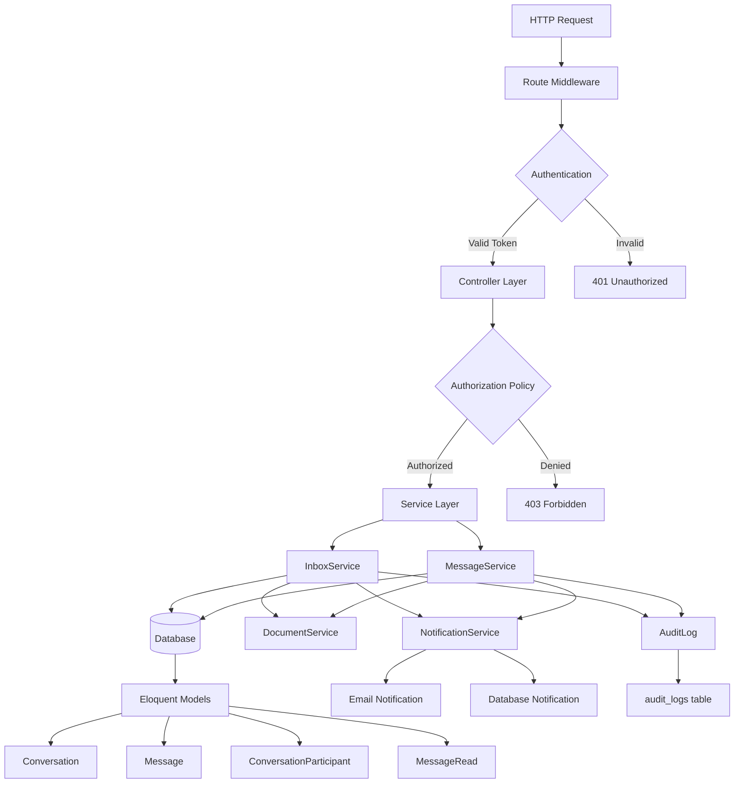
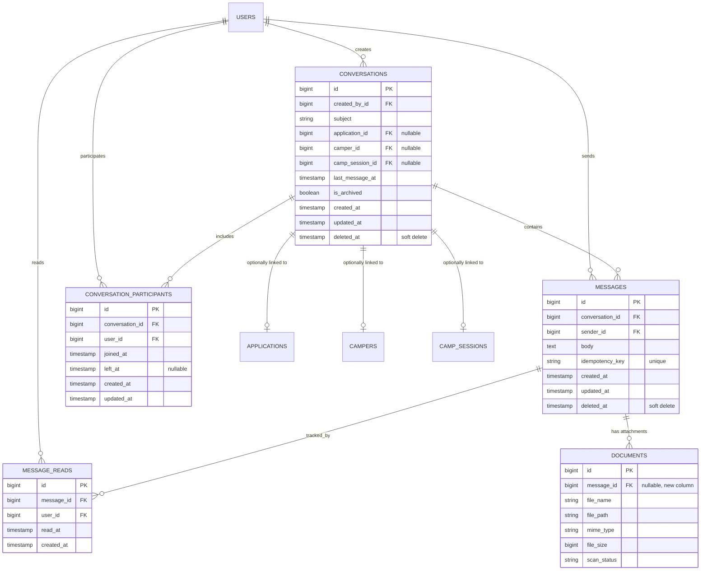
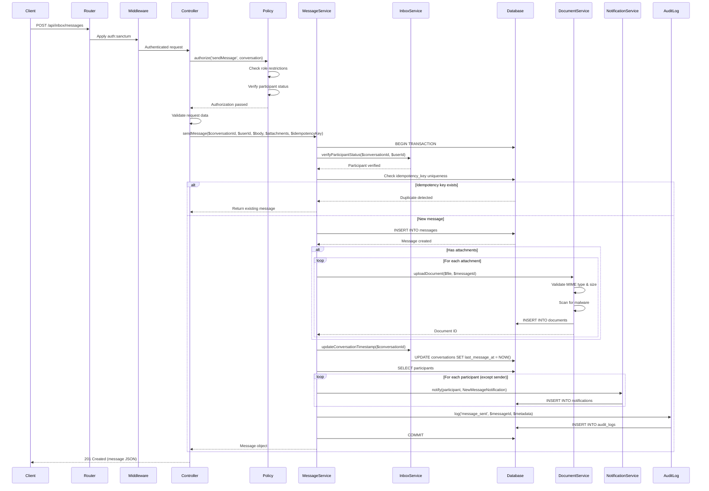
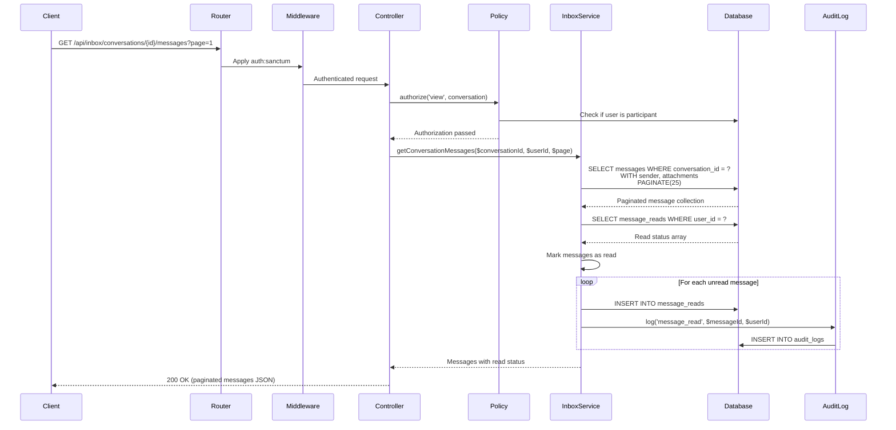

# INBOX MESSAGING SYSTEM - ENTERPRISE ARCHITECTURE

**Document Version:** 1.0
**Date:** 2026-02-13
**Status:** Design Phase
**System:** Camp Burnt Gin Application Software - Backend
**Framework:** Laravel 12, PHP 8.2+, MySQL 8.0+

---

## SECTION 1 — ARCHITECTURAL OVERVIEW

### 1.1 Executive Summary

The Inbox Messaging System provides secure, HIPAA-compliant internal communication between parents/guardians, administrators, and medical providers within the Camp Burnt Gin application ecosystem. This is an internal-only, RBAC-controlled messaging module that operates within strict role boundaries and maintains full audit trails for compliance.

**Key Architectural Principles:**

1. **Service Layer First:** All business logic resides in dedicated service classes, following established patterns from AuthService, DocumentService, and MedicalProviderLinkService.

2. **Policy-Based Authorization:** Role restrictions enforced through Laravel policies at both controller and service layers, preventing unauthorized access at multiple checkpoints.

3. **Immutable Message Design:** Messages are write-once, read-many. No editing or deletion, only soft deletion for audit trail preservation.

4. **PHI Protection:** No protected health information transmitted in email notifications. All PHI remains within the authenticated application boundary.

5. **Audit-First Design:** Every message send, read, and attachment access generates audit log entries for HIPAA compliance.

### 1.2 System Design Rationale

**Why Threaded Conversations?**

The threaded conversation model was chosen over flat messaging for several reasons:

- **Context Preservation:** Medical and administrative discussions require full historical context. A conversation thread maintains chronological coherence.

- **Reduced Cognitive Load:** Users view related messages together, reducing confusion and repetitive explanations.

- **Authorization Efficiency:** Permissions are checked once per conversation, not per message, reducing authorization overhead.

- **Relationship Scoping:** Conversations can be linked to Applications, Campers, or Camp Sessions, providing automatic context filtering.

**Why Immutable Messages?**

Messages cannot be edited after creation:

- **Audit Integrity:** HIPAA requires tamper-proof audit trails. Immutable messages prevent retroactive modification.

- **Legal Protection:** In disputes, unmodified message history provides clear evidence of communications.

- **Simplified Concurrency:** No optimistic locking or version control needed for message updates.

**Why Service Layer Pattern?**

Following the established pattern from AuthService and DocumentService:

- **Transaction Boundaries:** Services wrap multi-step operations in database transactions.

- **Reusability:** Business logic can be invoked from controllers, commands, or jobs without duplication.

- **Testability:** Service methods are pure functions with clear inputs and outputs, easily unit tested.

- **Consistency:** Maintains architectural consistency with the existing codebase.

### 1.3 Alignment with Existing Backend

**Integration Points:**

| Existing System | Integration Approach |
|----------------|---------------------|
| **AuthService** | Leverages Sanctum token authentication and session management |
| **DocumentService** | Reuses document upload, scanning, and storage for message attachments |
| **Notification System** | Extends existing notification infrastructure for message alerts |
| **AuditLog Model** | Logs all inbox operations using established audit pattern |
| **RBAC (User/Role)** | Enforces role-based restrictions through existing User::hasRole() methods |
| **Policy Pattern** | Follows ApplicationPolicy patterns for authorization |

**Naming Conventions:**

- Models: PascalCase singular (Conversation, Message)
- Services: PascalCase with "Service" suffix (InboxService, MessageService)
- Policies: PascalCase with "Policy" suffix (ConversationPolicy, MessagePolicy)
- Controllers: PascalCase with "Controller" suffix (ConversationController, MessageController)
- Routes: kebab-case with versioned prefix (/api/inbox/conversations)
- Database tables: snake_case plural (conversations, messages, conversation_participants)

### 1.4 Component Architecture



**Component Responsibilities:**

- **Controllers:** Request validation, policy enforcement, HTTP response formatting
- **Services:** Business logic, transaction management, cross-cutting concerns
- **Models:** Data representation, relationships, query scopes
- **Policies:** Authorization rules based on user roles and resource ownership
- **Notifications:** Alert delivery without PHI exposure

### 1.5 Data Model Design



**Design Justifications:**

**Conversations Table:**

- `subject`: Required for thread identification in listings. Max 255 characters.
- `created_by_id`: Establishes conversation ownership for authorization.
- `application_id`, `camper_id`, `camp_session_id`: Optional foreign keys for contextual filtering. Nullable because not all conversations are application-specific.
- `last_message_at`: Denormalized timestamp for efficient sorting without JOIN. Updated via database trigger or service layer.
- `is_archived`: Soft archive flag. Users can hide old conversations without deletion.
- `deleted_at`: Soft delete for audit compliance. Never hard delete conversations.

**Conversation_Participants Table:**

- Purpose: Many-to-many relationship between users and conversations.
- `joined_at`: Tracks when user was added to conversation.
- `left_at`: Allows users to "leave" conversations (soft removal).
- Why separate table? Enables efficient participant queries and role-based filtering.

**Messages Table:**

- `body`: TEXT type supports up to 65,535 characters. Sufficient for message content.
- `idempotency_key`: Prevents duplicate message submission on network retry. Unique index ensures single processing.
- `sender_id`: Foreign key to users. Establishes message authorship.
- `deleted_at`: Soft delete only. Preserves message history for audit.

**Message_Reads Table:**

- Purpose: Tracks read receipts for unread message count.
- `read_at`: Timestamp of first read. Does not track re-reads.
- Composite unique index on (message_id, user_id) prevents duplicate read records.
- Why separate table? Prevents denormalization in messages table and allows efficient "unread" queries.

**Documents Table Extension:**

- Add `message_id` nullable foreign key to existing documents table.
- Reuses existing document upload, scanning, and storage infrastructure.
- Maintains consistency with application document handling.

### 1.6 Sequence Diagrams

#### Sequence 1: Sending a Message



#### Sequence 2: Reading a Conversation Thread



### 1.7 Role-Based Access Control (RBAC) Rules

**Role Matrix:**

| Action | Parent | Admin | Medical Provider | Enforced By |
|--------|--------|-------|------------------|-------------|
| Create conversation with Admin | Yes | Yes | No | ConversationPolicy::create() |
| Create conversation with Parent | No | Yes | No | ConversationPolicy::create() |
| Create conversation with Medical | No | Yes | No | ConversationPolicy::create() |
| Reply in existing conversation | Yes (if participant) | Yes (if participant) | Yes (if participant) | MessagePolicy::create() |
| View conversation | Yes (if participant) | Yes (if participant) | Yes (if participant) | ConversationPolicy::view() |
| Archive conversation | Yes (if creator) | Yes (always) | No | ConversationPolicy::archive() |
| Add participant | No | Yes | No | ConversationPolicy::addParticipant() |
| Remove participant | No | Yes | No | ConversationPolicy::removeParticipant() |
| View all conversations | No | Yes | No | ConversationPolicy::viewAny() |

**Key Restrictions:**

1. **Parents:**
   - Cannot initiate conversations with other parents
   - Cannot initiate conversations with medical providers
   - Can only message admins directly
   - Can reply within conversations they are part of
   - Cannot add/remove participants

2. **Admins:**
   - Full conversation management rights
   - Can initiate conversations with any role
   - Can add/remove participants from conversations
   - Can view system-wide conversation reports

3. **Medical Providers:**
   - Can only respond within conversations they are added to
   - Cannot initiate new conversations
   - Cannot add/remove participants
   - Access limited to conversations related to their assigned campers

### 1.8 Design Trade-offs

**Decision 1: Polling vs. WebSockets**

**Chosen:** Polling (client fetches new messages on interval)

**Rationale:**
- Simpler infrastructure (no WebSocket server maintenance)
- Consistent with existing application architecture
- Sufficient for expected use case (administrative messaging, not real-time chat)
- Lower operational complexity
- Easier to scale horizontally

**Trade-off:**
- Slight delay in message delivery (poll interval: 30-60 seconds)
- Increased server load from polling requests

**Mitigation:**
- Implement rate limiting to prevent poll abuse
- Use efficient pagination and conditional requests (ETag/Last-Modified)
- Consider WebSocket upgrade in future if real-time requirements emerge

**Decision 2: Separate vs. Embedded Read Status**

**Chosen:** Separate `message_reads` table

**Rationale:**
- Prevents denormalization in messages table
- Allows efficient "unread count" queries per user
- Supports future read receipt features
- Aligns with normalized database design principles

**Trade-off:**
- Additional JOIN required for read status queries
- More database writes on message read operations

**Mitigation:**
- Index on (user_id, message_id) for fast lookups
- Lazy load read status only when needed
- Cache unread counts at conversation level

**Decision 3: Conversation Participants Table**

**Chosen:** Explicit many-to-many relationship table

**Rationale:**
- Supports multi-party conversations (future enhancement)
- Enables participant-level metadata (joined_at, left_at)
- Simplifies authorization checks (single query for participation)
- Allows role-specific participant queries

**Trade-off:**
- Additional table and JOIN operations
- More complex participant management logic

**Mitigation:**
- Eager load participants with conversations
- Index on (conversation_id, user_id) for fast lookups
- Limit participant count (max 10 per conversation)

**Decision 4: Soft Delete vs. Hard Delete**

**Chosen:** Soft delete for both conversations and messages

**Rationale:**
- HIPAA requires audit trail preservation
- Legal protection in disputes
- Data recovery capability
- Supports compliance reporting

**Trade-off:**
- Database growth over time
- Queries must always filter deleted_at
- Increased storage costs

**Mitigation:**
- Global scope on models to auto-filter deleted records
- Implement data retention policy (archive to cold storage after 7 years)
- Regular database maintenance and archival procedures

### 1.9 Performance and Scalability Strategy

**Target Performance Metrics:**

- 250 concurrent users
- Message send latency: < 500ms (p95)
- Conversation list load: < 200ms (p95)
- Message thread load: < 300ms (p95)
- Attachment upload: < 2s for 10MB file (p95)

**Optimization Techniques:**

**1. Database Indexing:**
```
conversations:
  - (created_by_id, deleted_at)
  - (last_message_at DESC) - for chronological sorting
  - (application_id, deleted_at)
  - (camper_id, deleted_at)

conversation_participants:
  - (conversation_id, user_id) UNIQUE
  - (user_id, left_at)

messages:
  - (conversation_id, created_at DESC)
  - (sender_id, created_at DESC)
  - (idempotency_key) UNIQUE

message_reads:
  - (message_id, user_id) UNIQUE
  - (user_id, read_at)

documents:
  - (message_id, deleted_at)
```

**2. Query Optimization:**
- Eager load relationships: `Conversation::with(['participants', 'lastMessage'])`
- Use pagination (25 messages per page)
- Implement cursor-based pagination for infinite scroll
- Avoid N+1 queries via relationship preloading

**3. Caching Strategy:**
- Cache unread message counts per user (Redis, 5-minute TTL)
- Cache conversation list per user (Redis, 2-minute TTL)
- Invalidate cache on new message or participant change
- Use cache tags for granular invalidation

**4. Rate Limiting:**
- Message send: 20 per minute per user
- Conversation create: 5 per hour per user
- Attachment upload: 10 per hour per user
- API endpoint: 100 requests per minute per user

**5. Database Connection Pooling:**
- Use Laravel Octane for persistent connections
- Connection pool size: 10-20 connections per application instance
- Query timeout: 5 seconds

**6. Horizontal Scaling:**
- Stateless application design (no session storage on server)
- Load balancer distributes requests across multiple Laravel instances
- Shared Redis cache for cross-instance consistency
- Shared MySQL database with read replicas for query distribution

---

## SECTION 1 COMPLETE

**Next Sections:**
- Section 2: Database Design (Migrations)
- Section 3: Eloquent Models
- Section 4: Policies & Authorization
- Section 5: Services Layer
- Section 6: Controllers & Routes
- Section 7: Notifications Integration
- Section 8: Audit Logging
- Section 9: Testing Strategy
- Section 10: Documentation Updates
- Section 11: Threat Model

**Status:** Architecture design complete. Ready for implementation phase.
