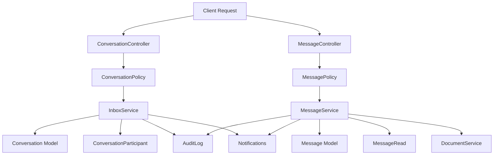

# System Architecture

This document provides a comprehensive overview of the Camp Burnt Gin API architecture, including design patterns, technology choices, component organization, and architectural decisions that guide system implementation and maintenance.

---

## System Purpose and Scope

### Business Context

Camp Burnt Gin is a camp program that requires a secure, compliant system to manage camp registration, medical information, staff workflows, and administrative operations. The system replaces a third-party platform and serves as the authoritative system of record for all camp-related data.

### Included Functionality

The backend system provides:

- **User Management** - Registration, authentication, multi-factor authentication, profile management, avatar uploads, account deletion
- **Camp Management** - Camp definitions, session scheduling, age restrictions, capacity tracking
- **Camper Management** - Camper profiles linked to parent accounts with age calculation, risk summaries, compliance status, and medical alerts
- **Application Processing** - Draft support, submission, review, digital signatures, status tracking; dynamic form schema binding via the Form Builder
- **Medical Information** - Medical records, allergies, medications, diagnoses, behavioral profiles, feeding plans, assistive devices, activity permissions, and emergency contacts
- **Medical Incidents and Visits** - Incident recording, follow-up tracking, visit logging, medical restrictions, and clinical statistics dashboard
- **Treatment Logs** - Clinical notes recorded by medical staff, linked to visits and camper records
- **Medical Provider Links** - Secure, time-limited token-based access for external providers
- **Document Management** - Secure file uploads with MIME validation and security scanning; applicant document distribution and collection
- **Document Requests** - Admin-initiated document request lifecycle with inbox integration, deadline management, and approval workflow
- **Inbox and Messaging** - Threaded conversation system with participant management, read receipts, attachments, star/important/trash states, and system-generated notifications
- **Announcements** - Admin-created announcements pinnable to user dashboards
- **Calendar Events** - Camp-related event management
- **Notification System** - Email and in-app notifications for status changes, administrative actions, and document requests; user-configurable notification preferences
- **Reporting** - Administrative reports including acceptance/rejection lists, mailing labels, ID labels, and application summaries
- **Form Builder** - Dynamic application form management with versioned schema definitions, section/field/option CRUD, field deactivation, and cache-backed schema serving
- **Audit Logging** - Full audit trail for all PHI access, authentication events, and administrative actions; exportable in CSV and JSON
- **Security Controls** - Rate limiting, account lockout, token expiration, PHI encryption, HIPAA-compliant session management

### Excluded Functionality

The backend system explicitly does NOT include:

- **Payment Processing** - Financial transactions are deferred to future implementation
- **Third-Party Integrations** - External service integrations beyond SMTP email are not implemented
- **Mobile Applications** - The API is device-agnostic but mobile apps are not developed
- **Real-Time Features** - WebSockets or server-sent events are not implemented

### Integration Points

#### Email Notifications

The system sends email notifications via SMTP for:

- Application submission confirmations
- Application status changes (approved/rejected/waitlisted)
- Medical provider link creation
- Medical provider link expiration warnings
- Acceptance and rejection letters
- Incomplete application reminders

**Configuration:** SMTP credentials configured in `.env` file

#### Medical Provider Links

External medical providers access the system via secure, time-limited links:

- **Access Method:** Unauthenticated token-based access
- **Token Length:** 64-character cryptographically secure random string
- **Default Expiration:** 72 hours
- **Single Use:** Links are marked as used after submission
- **Revocable:** Parents and admins can revoke links at any time

#### Frontend Integration

The backend exposes a RESTful API for frontend consumption:

- **Protocol:** HTTP/JSON
- **Authentication:** Bearer token in Authorization header
- **CORS:** Configured for specified frontend domains
- **Rate Limiting:** 60 requests/minute per user for general API endpoints

### Performance and Known Limitations

#### Performance Metrics

| Metric | Value |
|--------|-------|
| Test Suite Runtime | < 3 seconds |
| API Response Time | < 500ms average |
| Database Query Performance | 5-10x improvement via indexing |
| Notification Processing | 81% faster via async queuing |

#### Known Limitations

The following limitations are by design:

1. **Payment Processing** - Deferred to future implementation
2. **File Type Restrictions** - Limited to PDF, images, Word documents
3. **File Size Limit** - Maximum 10 MB per upload
4. **Email Dependency** - Notifications require SMTP configuration
5. **Real-Time Features** - WebSockets or server-sent events are not implemented; all messaging is asynchronous

---

## 1. High-Level Overview

The Camp Burnt Gin API is a Laravel 12-based RESTful backend designed to manage camp registration, medical records, staff workflows, and administrative oversight. The system serves as the authoritative data source for all camp operations and is built to handle Protected Health Information (PHI) in compliance with HIPAA security requirements.

### Purpose

Provide a secure, scalable, and maintainable API backend that enables:
- Secure management of camper registration and applications
- Protected storage and access of medical information (PHI)
- Role-based authorization for parents, administrators, and medical providers
- Comprehensive audit logging for compliance
- Integration with the React 18/TypeScript frontend application

### Key Goals

| Goal | Description |
|------|-------------|
| **Security** | Token-based authentication, role-based access control, PHI encryption, audit logging |
| **Modularity** | Layered architecture with clear separation of concerns |
| **Scalability** | Stateless API design supporting horizontal scaling |
| **Maintainability** | Service layer isolation, comprehensive testing, consistent patterns |

---

## 2. Architecture Style

### RESTful API Pattern

The system implements a **RESTful API architecture** using Laravel 12's routing and controller conventions. All client interactions occur through stateless HTTP requests using standard REST verbs (GET, POST, PUT, DELETE).

### Layered Architecture

The application follows a strict **layered architecture** where each layer has defined responsibilities and dependencies flow downward only:

```
Client Layer (Frontend/Mobile)
        ↓
Routes Layer (Endpoint definitions)
        ↓
Middleware Layer (Auth, RBAC, Rate limiting)
        ↓
Controller Layer (Request handling)
        ↓
Form Request Layer (Validation) + Policy Layer (Authorization)
        ↓
Service Layer (Business logic)
        ↓
Model Layer (Data access, relationships)
        ↓
Database Layer (MySQL persistence)
```

### Separation of Concerns

Each layer has a single, well-defined responsibility:

- **Controllers** — Receive requests, delegate to services, return responses
- **Services** — Contain all business logic and orchestrate workflows
- **Models** — Represent database entities and relationships
- **Policies** — Enforce authorization rules
- **Form Requests** — Validate and sanitize input data

This separation ensures:
- Business logic is testable in isolation
- Controllers remain thin and focused
- Database queries are encapsulated in models
- Authorization is consistent across endpoints

---

## 3. Technology Stack

| Layer | Technology | Purpose |
|-------|------------|---------|
| **Backend Framework** | Laravel 12 | RESTful API framework with ORM, routing, middleware |
| **Language** | PHP 8.2+ | Modern PHP with type declarations and error handling |
| **Database** | MySQL 8.0+ | Relational storage with foreign key constraints |
| **Authentication** | Laravel Sanctum | Token-based API authentication |
| **Authorization** | Laravel Policies | Role-based access control (RBAC) |
| **Multi-Factor Auth** | PragmaRX Google2FA | TOTP-based MFA implementation |
| **Notifications** | Laravel Notifications | Email and database notification delivery |
| **Queue System** | Laravel Queues | Asynchronous job processing (emails, document scanning) |
| **Testing** | PHPUnit + Laravel Testing | Unit and feature test framework |
| **File Storage** | Laravel Storage | Secure file upload and retrieval |
| **Validation** | Laravel Form Requests | Input validation with custom rules |

---

## 4. Directory Structure

### Application Directory (`app/`)

```
app/
├── Http/
│   ├── Controllers/Api/     # API endpoint controllers (domain-organized)
│   │   ├── Auth/           # Authentication controllers
│   │   ├── Camp/           # Camp management controllers
│   │   ├── Camper/         # Camper and application controllers
│   │   ├── Document/       # Document and provider link controllers
│   │   ├── Inbox/          # Inbox messaging controllers
│   │   ├── Medical/        # Medical record controllers
│   │   └── System/         # System health and notification controllers
│   ├── Requests/            # Form request validation classes (domain-organized)
│   └── Middleware/          # Custom middleware (audit logging, role checks)
├── Services/                # Business logic (domain-organized)
│   ├── Auth/               # Authentication services
│   ├── Camper/             # Application workflow services
│   ├── Document/           # Document enforcement services
│   ├── Inbox/              # Conversation and message services
│   ├── Medical/            # Medical assessment services
│   └── System/             # Reporting and letter services
├── Models/                  # Eloquent models and relationships
├── Policies/                # Authorization rules for model operations
├── Notifications/           # Notification classes (domain-organized)
│   ├── Auth/               # Authentication notifications
│   ├── Camper/             # Application notifications
│   ├── Document/           # Provider link notifications
│   ├── Medical/            # Medical update notifications
│   └── System/             # System-level notifications
├── Jobs/                    # Asynchronous queue jobs
├── Traits/                  # Reusable functionality (notifications, etc.)
└── Enums/                   # Enumeration classes (statuses, roles, severity levels)
```

### Database Directory (`database/`)

```
database/
├── migrations/              # Database schema definitions (timestamped)
├── seeders/                 # Development and test data seeders
└── factories/               # Model factories for testing
```

### Routes Directory (`routes/`)

```
routes/
├── api.php                  # API endpoint definitions (all /api/* routes)
└── web.php                  # Web routes (minimal, not used for API)
```

### Documentation Directory (`docs/`)

```
docs/
├── API_REFERENCE.md         # Complete endpoint documentation (includes API overview)
├── ARCHITECTURE.md          # This document
├── SECURITY.md              # Security architecture and HIPAA compliance
├── TESTING.md               # Testing strategy and execution
└── ...                      # Additional technical documentation
```

### Tests Directory (`tests/`)

```
tests/
├── Feature/                 # End-to-end API endpoint tests
├── Unit/                    # Isolated component tests (services, models)
└── TestCase.php             # Base test case with shared utilities
```

---

## 5. Core Components

### Authentication System

**Technology:** Laravel Sanctum token-based authentication

**Components:**
- `Auth\AuthController` — Registration, login, logout endpoints
- `Auth\AuthService` — Credential validation, token generation
- `Auth\MfaController` — Multi-factor authentication setup and verification
- `Auth\MfaService` — TOTP secret generation and code validation

**Features:**
- Email and password authentication
- TOTP-based multi-factor authentication (Google Authenticator compatible)
- Token expiration and revocation
- Account lockout after failed attempts
- Password reset flow

### Application Workflow Engine

**Purpose:** Manage complete application lifecycle from draft to final decision

**Components:**
- `Camper\ApplicationController` — Application operations
- `Camper\ApplicationService` — Application approval workflow and compliance
- `ApplicationPolicy` — Authorization rules
- `Application` Model — Application data with status tracking
- `ApplicationStatus` Enum — Valid status values and transitions

**Features:**
- Draft mode with auto-save capability
- Digital signature capture
- Status workflow (pending → under review → approved/rejected/waitlisted)
- Admin review with notes
- Automatic notification dispatch
- Acceptance and rejection letter generation

### Role-Based Authorization

**Technology:** Laravel Policies with custom middleware

**Roles:**
- `super_admin` — Absolute system authority, delegation governance, role management
- `admin` — Full operational access, application review, reporting
- `applicant` — Own campers and applications only (displayed as "Parent" in the UI)
- `medical` — Medical information access via provider links (token-based, no user account)

**Hierarchical Authority:**
- super_admin > admin > applicant > medical
- super_admin inherits admin privileges via isAdmin() override
- Only super_admin can assign roles and manage delegation

**Enforcement Layers:**
1. **Route Middleware** — Restricts entire routes by role
2. **Policy Layer** — Fine-grained model-level authorization (includes RolePolicy for delegation governance)
3. **Relationship Validation** — Ownership checks (e.g., parent owns camper)
4. **Model Safeguards** — Last super_admin deletion prevention via boot() events

### Audit Logging System

**Purpose:** HIPAA-compliant audit trail for PHI access

**Implementation:**
- `AuditPhiAccess` Middleware — Logs all PHI-related requests
- `AuditLog` Model — Stores access records with user, resource, timestamp, IP
- Graceful failure handling (logging failures do not block requests)

**Logged Actions:**
- Medical record access (view, create, update)
- Allergy and medication access
- Emergency contact access
- Document downloads
- Provider link creation and revocation

### Document Upload System

**Purpose:** Secure file upload with validation and security scanning

**Components:**
- `Document\DocumentController` — Upload, download, delete operations
- `Document\DocumentEnforcementService` — Document compliance and validation
- `DocumentPolicy` — Authorization for document access
- `Document` Model — Polymorphic file metadata

**Features:**
- MIME type validation
- File size limits (10 MB)
- Dangerous extension detection
- Security scanning (async, blocks download until passed)
- Polymorphic attachment (documents can attach to campers, applications, medical records)

### Multi-Factor Authentication (MFA) System

**Technology:** PragmaRX Google2FA (TOTP-based)

**Workflow:**
1. User enables MFA via setup endpoint
2. System generates secret and QR code URL
3. User scans QR code with authenticator app
4. User verifies with 6-digit code
5. System enables MFA for user account
6. Future logins require email + password + TOTP code

**Security Features:**
- Cryptographically secure secret generation
- Rate limiting on MFA verification attempts
- Fallback mechanism (future enhancement)

### Inbox Messaging Architecture

**Purpose:** Provide secure, HIPAA-compliant internal communication between system users with threaded conversations, read receipts, and attachment support.

**Components:**

| Component | Purpose | Location |
|-----------|---------|----------|
| Conversation Model | Thread container with metadata | `app/Models/Conversation.php` |
| Message Model | Individual messages (immutable) | `app/Models/Message.php` |
| ConversationParticipant Model | User membership tracking | `app/Models/ConversationParticipant.php` |
| MessageRead Model | Read receipt tracking | `app/Models/MessageRead.php` |
| InboxService | Conversation operations | `app/Services/Inbox/InboxService.php` |
| MessageService | Message operations | `app/Services/Inbox/MessageService.php` |
| ConversationPolicy | Conversation authorization | `app/Policies/ConversationPolicy.php` |
| MessagePolicy | Message authorization | `app/Policies/MessagePolicy.php` |
| ConversationController | Conversation endpoints | `app/Http/Controllers/Api/Inbox/ConversationController.php` |
| MessageController | Message endpoints | `app/Http/Controllers/Api/Inbox/MessageController.php` |

**Architecture Diagram:**



**Design Principles:**

**Immutable Messages**

Messages are write-once entities that cannot be edited after creation:
- Maintains audit integrity for HIPAA compliance
- Prevents retroactive modification in legal contexts
- Simplifies concurrency control
- Only soft delete available (admin only)

**Threaded Conversations**

All messages belong to conversations:
- Preserves context for medical discussions
- Reduces cognitive load for users
- Enables efficient permission scoping
- Supports subject lines and metadata

**Participant-Based Access**

Conversations use explicit participant lists:
- Users must be participants to view/send messages
- Participants can leave conversations
- Admins can manage participants
- Participant join/leave timestamps tracked

**Context Linking**

Conversations can be linked to:
- Applications (application-specific discussions)
- Campers (general camper discussions)
- Camp Sessions (session-wide announcements)
- NULL (general admin-parent communication)

**Service Layer Operations:**

**InboxService Responsibilities:**
- `createConversation()` - Create conversation with participants
- `addParticipant()` - Add user to conversation
- `removeParticipant()` - Remove user from conversation
- `archiveConversation()` - Archive conversation
- `unarchiveConversation()` - Restore archived conversation
- `getUserConversations()` - Paginated conversation list
- `getUnreadConversationCount()` - Unread conversation count

**MessageService Responsibilities:**
- `sendMessage()` - Send message with idempotency
- `markAsRead()` - Mark message as read
- `getConversationMessages()` - Paginated messages
- `getUnreadMessageCount()` - Global unread count
- `accessAttachment()` - Secure attachment access
- `deleteMessage()` - Soft delete (admin only)

**Authorization Model:**

**Conversation Access:**
- View: Participant in conversation
- Create: Any authenticated user
- Archive: Participant in conversation
- Delete: Admin only (soft delete)

**Message Access:**
- View: Participant in conversation
- Send: Participant in conversation
- Delete: Admin only (soft delete)

**Data Retention:**
- Soft deletes preserve audit trail
- No hard deletes in production
- Read receipts maintained indefinitely

**API Endpoints:**

The Inbox subsystem provides 15 RESTful endpoints organized into conversation and message operations:

**Conversation Endpoints (9):**
- `GET /api/inbox/conversations` - List user conversations
- `POST /api/inbox/conversations` - Create conversation
- `GET /api/inbox/conversations/{id}` - View conversation
- `POST /api/inbox/conversations/{id}/archive` - Archive conversation
- `POST /api/inbox/conversations/{id}/unarchive` - Unarchive conversation
- `POST /api/inbox/conversations/{id}/participants` - Add participant
- `DELETE /api/inbox/conversations/{id}/participants/{user}` - Remove participant
- `POST /api/inbox/conversations/{id}/leave` - Leave conversation
- `DELETE /api/inbox/conversations/{id}` - Delete conversation (admin)

**Message Endpoints (6):**
- `GET /api/inbox/conversations/{id}/messages` - List messages
- `POST /api/inbox/conversations/{id}/messages` - Send message
- `GET /api/inbox/messages/{id}` - View message
- `GET /api/inbox/messages/unread-count` - Get unread count
- `GET /api/inbox/messages/{id}/attachments/{doc}` - Download attachment
- `DELETE /api/inbox/messages/{id}` - Delete message (admin)

**Database Schema:**

**conversations table:**
- Subject line and participant metadata
- Optional context linking (application_id, camper_id, camp_session_id)
- Archive status and last message timestamp
- Soft delete support

**conversation_participants table:**
- Many-to-many relationship between users and conversations
- Join and leave timestamps
- Active participant filtering

**messages table:**
- Conversation threading
- Sender identification
- Message body (immutable)
- Idempotency key for duplicate prevention
- Soft delete support

**message_reads table:**
- User-message read tracking
- Read timestamp
- Unique constraint per user-message pair

**Performance Optimizations:**
- Eager loading prevents N+1 queries
- Composite indexes for active conversation listing
- Pagination for message threads (25 per page)
- Unread counts calculated via optimized queries

---

## 6. Data Flow

### Request Lifecycle

```
┌─────────────────────────────────────────────────────────────┐
│ 1. Client sends HTTP request to /api/* endpoint             │
└─────────────────────────────────────────────────────────────┘
                        ↓
┌─────────────────────────────────────────────────────────────┐
│ 2. Route matches endpoint definition in routes/api.php      │
└─────────────────────────────────────────────────────────────┘
                        ↓
┌─────────────────────────────────────────────────────────────┐
│ 3. Middleware validates authentication token (Sanctum)      │
│    → Token missing/invalid: Return 401 Unauthorized         │
└─────────────────────────────────────────────────────────────┘
                        ↓
┌─────────────────────────────────────────────────────────────┐
│ 4. Middleware verifies user role (if required)              │
│    → Insufficient role: Return 403 Forbidden                │
└─────────────────────────────────────────────────────────────┘
                        ↓
┌─────────────────────────────────────────────────────────────┐
│ 5. Controller method invoked                                │
└─────────────────────────────────────────────────────────────┘
                        ↓
┌─────────────────────────────────────────────────────────────┐
│ 6. Form Request validates input data                        │
│    → Validation fails: Return 422 with field errors         │
└─────────────────────────────────────────────────────────────┘
                        ↓
┌─────────────────────────────────────────────────────────────┐
│ 7. Policy checks authorization for action                   │
│    → Authorization fails: Return 403 Forbidden              │
└─────────────────────────────────────────────────────────────┘
                        ↓
┌─────────────────────────────────────────────────────────────┐
│ 8. Controller delegates to Service method                   │
└─────────────────────────────────────────────────────────────┘
                        ↓
┌─────────────────────────────────────────────────────────────┐
│ 9. Service executes business logic                          │
│    - Coordinates multiple models                            │
│    - Enforces business rules                                │
│    - Manages database transactions                          │
└─────────────────────────────────────────────────────────────┘
                        ↓
┌─────────────────────────────────────────────────────────────┐
│ 10. Service interacts with Model(s)                         │
│     Models query database via Eloquent ORM                  │
└─────────────────────────────────────────────────────────────┘
                        ↓
┌─────────────────────────────────────────────────────────────┐
│ 11. Service returns result to Controller                    │
└─────────────────────────────────────────────────────────────┘
                        ↓
┌─────────────────────────────────────────────────────────────┐
│ 12. Controller formats HTTP response (JSON)                 │
└─────────────────────────────────────────────────────────────┘
                        ↓
┌─────────────────────────────────────────────────────────────┐
│ 13. Response returned to client with appropriate status code│
└─────────────────────────────────────────────────────────────┘
```

### Controller → Service → Model Example

**Controller (Thin):**
```php
public function store(StoreApplicationRequest $request)
{
    $application = $this->applicationService->create(
        $request->validated()
    );

    return response()->json($application, 201);
}
```

**Service (Business Logic):**
```php
public function create(array $data): Application
{
    // Validate business rules
    $this->validateUniqueApplication($data['camper_id'], $data['camp_session_id']);

    // Create application with transaction
    DB::beginTransaction();
    try {
        $application = Application::create($data);
        $this->notifyApplicationCreated($application);
        DB::commit();
        return $application;
    } catch (\Exception $e) {
        DB::rollBack();
        throw $e;
    }
}
```

**Model (Data Access):**
```php
class Application extends Model
{
    protected $fillable = ['camper_id', 'camp_session_id', 'status'];

    public function camper()
    {
        return $this->belongsTo(Camper::class);
    }

    public function campSession()
    {
        return $this->belongsTo(CampSession::class);
    }
}
```

---

## 7. Security Architecture

### Token-Based Authentication

**Implementation:** Laravel Sanctum API tokens

- Tokens generated on successful login
- Tokens transmitted via `Authorization: Bearer {token}` header
- Tokens validated on every request via middleware
- Tokens expire after configurable period (default: 30 minutes)
- Tokens revoked on logout

### Authorization Policies

**Ownership Model:**
- Parents can only access their own campers and applications
- Admins have full access to all resources
- Medical providers access specific records via secure tokens

**Policy Enforcement:**
- All model operations protected by policies
- Authorization checked before service layer execution
- Consistent authorization logic across all endpoints

### IDOR Prevention

**Insecure Direct Object Reference** attacks are prevented through:

1. **Policy Layer** — Verifies user has permission to access resource
2. **Relationship Validation** — Confirms ownership relationships (e.g., user → camper → application)
3. **Database Constraints** — Foreign keys enforce referential integrity

### Input Validation

**Form Request Classes:**
- All input validated before reaching controllers
- Custom validation rules for domain logic (age ranges, date constraints)
- Sanitization of user input
- Type casting and transformation

### Audit Logging

**PHI Access Logging:**
- All access to medical records, allergies, medications logged
- Logs include user, resource, timestamp, IP address, user agent
- Logs are tamper-evident (no update/delete operations)
- Graceful failure (logging errors do not block API requests)

### Secure File Handling

**Document Security:**
- MIME type validation prevents executable uploads
- File extension checking blocks dangerous file types
- Security scanning detects malware patterns
- Unscanned files blocked from download (non-admin users)
- Polymorphic storage prevents direct file access

### Inbox Security

**Participant Verification:**
- All conversation operations verify active participant status
- Removed participants cannot access conversation
- Policy checks at both controller and service layers
- Join/leave timestamps tracked for audit

**Message Immutability:**
- No edit endpoints exist
- Soft delete maintains audit trail
- Idempotency keys prevent duplicate sends
- All message operations logged

**Attachment Security:**
- Message attachments use DocumentService scanning
- Access logged in audit trail
- MIME type and size validation enforced
- Maximum 5 attachments per message (10MB each)

**Access Control:**
- Conversation access restricted to active participants
- Messages inherit conversation participant restrictions
- Admins have moderation capabilities (soft delete only)
- Read receipts track PHI access patterns

---

## 8. Scalability & Performance

### Stateless API Design

The API is fully stateless:
- No server-side session storage
- All authentication via tokens
- Each request contains complete context

**Benefits:**
- Horizontal scaling across multiple application servers
- Load balancing without session affinity
- High availability with minimal coordination

### Database Optimization

**Indexing Strategy:**
- Foreign keys indexed automatically
- Frequently queried columns indexed explicitly
- Composite indexes for multi-column queries
- Unique indexes for constraint enforcement

**Query Optimization:**
- Eager loading prevents N+1 query problems
- Query scopes encapsulate reusable filters
- Pagination reduces memory consumption
- Select only required columns

### Service Layer Separation

**Benefits:**
- Business logic isolated from controllers enables caching at service layer
- Database-agnostic service interfaces support future optimizations
- Transaction management centralized in services

### Asynchronous Processing

**Queue System:**
- Email notifications dispatched to queues
- Document security scanning runs asynchronously
- Long-running reports can be queued
- Retry logic with exponential backoff

### Horizontal Scaling Considerations

The architecture supports horizontal scaling:

1. **Database Layer** — MySQL supports read replicas for scaling reads
2. **Application Layer** — Stateless design allows multiple app servers
3. **Queue Layer** — Queue workers can scale independently
4. **File Storage Layer** — Can migrate to S3-compatible storage for distributed access

---

## 9. Future Expansion

The architecture is designed to support future growth and feature additions:

### Extensibility Points

| Extension | How Architecture Supports It |
|-----------|------------------------------|
| **Additional User Roles** | Role-based middleware and policies are extensible |
| **External Integrations** | Service layer can integrate with third-party APIs |
| **Real-Time Notifications** | Queue system can be extended with WebSocket broadcasting |
| **Advanced Reporting** | Report service can be extended with new report types |
| **Mobile Applications** | RESTful API supports any HTTP client |
| **Payment Processing** | Service layer can integrate payment gateway |
| **Calendar Integration** | Service layer can sync sessions with external calendars |

### Modularity Benefits

The layered architecture allows:
- **Independent Layer Updates** — Services can be refactored without changing controllers
- **Feature Toggles** — New features can be enabled/disabled via configuration
- **A/B Testing** — Service layer supports multiple implementations
- **Version Migration** — API versioning can be added at route level

### Maintainability

Consistent patterns across the codebase:
- Controllers follow identical structure
- Services use standard input/output patterns
- Models use consistent naming and relationship definitions
- Tests follow predictable organization

This consistency reduces onboarding time and maintenance burden.

---

## Summary

The Camp Burnt Gin API architecture prioritizes **security, maintainability, and scalability** through:

- **Layered design** with clear separation of concerns
- **RESTful API** following industry conventions
- **Token-based authentication** with multi-factor support
- **Role-based authorization** with fine-grained policies
- **Service layer isolation** for testable business logic
- **Comprehensive audit logging** for HIPAA compliance
- **Stateless design** supporting horizontal scaling

This architecture provides a solid foundation for current operations and future expansion.
