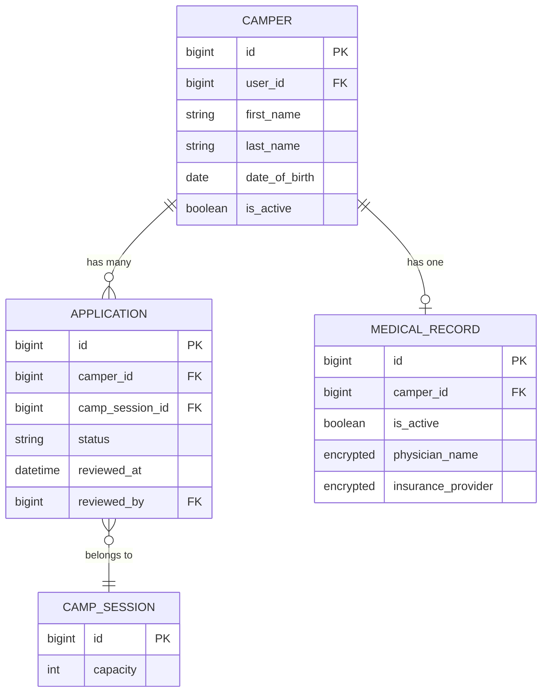
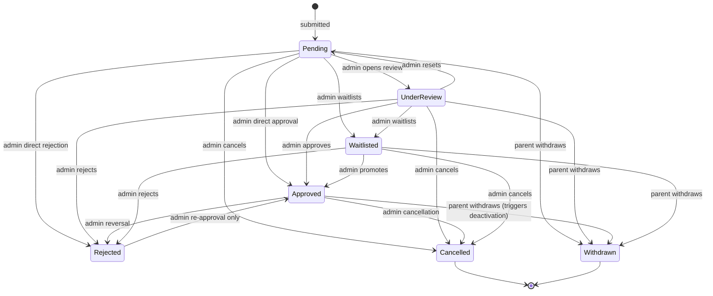
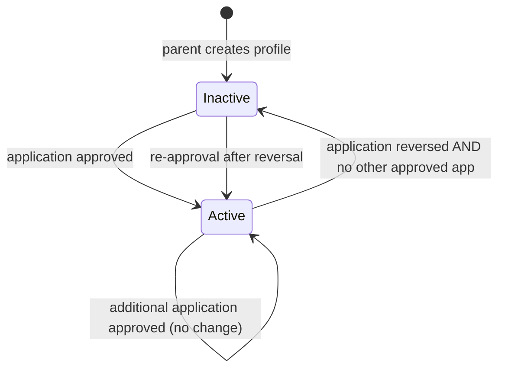
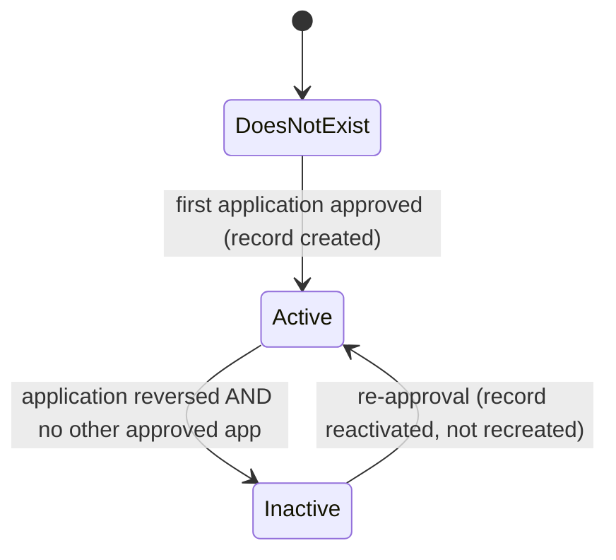
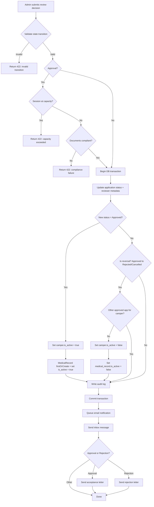

# Application, Camper, and Medical Record Workflow Specification

**System:** Camp Burnt Gin
**Date:** 2026-03-24
**Status:** Authoritative — this document supersedes all prior descriptions of the approval, reversal, and re-approval workflows.

---

## Table of Contents

1. [Purpose](#1-purpose)
2. [Core Concepts](#2-core-concepts)
3. [Entity Relationships](#3-entity-relationships)
4. [State Models](#4-state-models)
5. [Approval Workflow](#5-approval-workflow)
6. [Rejection Workflow (Before Approval)](#6-rejection-workflow-before-approval)
7. [Reversal Workflow (After Approval)](#7-reversal-workflow-after-approval)
8. [Re-Approval Workflow](#8-re-approval-workflow)
9. [Parent Withdrawal Workflow](#9-parent-withdrawal-workflow)
10. [System Invariants](#10-system-invariants)
11. [Data Flow](#11-data-flow)
12. [Notifications](#12-notifications)
13. [Authorization Rules](#13-authorization-rules)
14. [Audit Requirements](#14-audit-requirements)
15. [Edge Case Handling](#15-edge-case-handling)
16. [Transaction Requirements](#16-transaction-requirements)
17. [Query and Visibility Rules](#17-query-and-visibility-rules)
18. [Conclusion](#18-conclusion)

---

## 1. Purpose

This document defines the authoritative behavior for the application lifecycle, camper lifecycle, and medical record lifecycle in the Camp Burnt Gin system.

It is the single source of truth for:

- How applications are approved and rejected.
- How approval activates operational camper and medical records.
- How reversal (approved to rejected) deactivates those records without deleting them.
- How re-approval (rejected back to approved) restores operational access.
- How parents withdraw their own applications (distinct from admin cancellation).
- The distinction between `withdrawn` (parent-initiated) and `cancelled` (admin-initiated).
- What invariants the system enforces at all times.

Any implementation that conflicts with this document is incorrect and must be corrected to match the behavior defined here.

---

## 2. Core Concepts

### Application

An application is an intake and review object. It represents a parent's formal request to enroll a specific camper in a specific camp session. Its purpose is to capture the intake data, consent, and documentation required for an admin to make an enrollment decision.

An application is not an operational record. It does not by itself make a camper a participant, nor does it activate medical workflows. It is a gate through which a camper must pass before operational records are established.

### Camper

A camper is both a biographical profile and an operational participant record. Parents create the biographical profile (name, date of birth, gender) when registering a child in the system. The operational dimension — represented by the `is_active` flag — is managed exclusively by the application review workflow.

`is_active = true` means the camper has at least one currently approved application and is an active participant in camp operations. The camper appears on admin rosters, medical staff queues, session dashboards, and all operational views.

`is_active = false` means the camper has no currently approved application. The biographical record is retained for audit, re-application, and record-retention purposes but is removed from all operational views.

### Medical Record

A medical record is the internal clinical health record for a camper. It is a Protected Health Information (PHI) document and is governed by HIPAA requirements. It contains physician details, insurance information, health flags, diagnoses, medications, and allergies.

A medical record exists only for campers who have been through at least one approval cycle. It is created at the moment of first approval, not at application submission.

`is_active = true` means the associated camper is currently active. The medical record appears in medical staff workflows, dashboards, and rosters.

`is_active = false` means the associated camper's application was reversed or cancelled and no other approved application exists. The record is retained for HIPAA audit and record-retention compliance but is excluded from active medical workflows.

---

## 3. Entity Relationships

```
Application ──(camper_id)──► Camper ──(has one)──► MedicalRecord
     │                          │
     └──(camp_session_id)──►  CampSession
```

- One **Camper** may have many **Applications** (one per session per enrollment cycle).
- One **Camper** has at most one **MedicalRecord** (created at first approval, retained across all future cycles).
- One **Application** references exactly one **Camper** and one **CampSession**.



---

## 4. State Models

### Application States

| State | Value | Description | Can Parent Edit | Who Sets |
|-------|-------|-------------|-----------------|----------|
| Submitted | `submitted` | Submitted; awaiting admin review | Yes | System |
| Under Review | `under_review` | Admin has opened the application for review | Yes | Admin |
| Approved | `approved` | Admin has accepted the application | No | Admin |
| Rejected | `rejected` | Admin has declined the application | No | Admin |
| Waitlisted | `waitlisted` | Session capacity reached; queued for promotion | No | Admin |
| Cancelled | `cancelled` | Application cancelled by administrator | No | Admin only |
| Withdrawn | `withdrawn` | Voluntarily withdrawn by parent | No | Parent only |

**Terminal states** (no further transitions from either actor): `cancelled`, `withdrawn`.
`rejected` is not terminal — admins may re-approve. Parents may NOT re-open rejected applications; only admins can re-approve.

#### Application State Transition Diagram



#### Authoritative Transition Tables

**Admin-level transitions** (via `POST /applications/{id}/review`):

| From \ To | Pending | UnderReview | Approved | Rejected | Waitlisted | Cancelled |
|-----------|---------|-------------|----------|----------|------------|-----------|
| Pending | — | Yes | Yes | Yes | Yes | Yes |
| UnderReview | Yes | — | Yes | Yes | Yes | Yes |
| Approved | No | No | — | Yes (reversal) | No | Yes |
| Rejected | No | No | Yes (re-approval only) | — | No | No |
| Waitlisted | No | No | Yes | Yes | — | Yes |
| Cancelled | No | No | No | No | No | — |
| Withdrawn | No | No | No | No | No | — |

**Parent-level transitions** (via `POST /applications/{id}/withdraw`):

| From | To | Notes |
|------|----|-------|
| Pending | Withdrawn | Application not yet reviewed |
| UnderReview | Withdrawn | Withdrawal during admin review |
| Approved | Withdrawn | Triggers camper/medical deactivation |
| Waitlisted | Withdrawn | Removes from waitlist |
| Rejected | ❌ Not allowed | Admin decision is on record |
| Cancelled | ❌ Not allowed | Terminal |
| Withdrawn | ❌ Not allowed | Already withdrawn |

### Camper States

| State (`is_active`) | Meaning | Operational Visibility |
|---------------------|---------|------------------------|
| `true` | Camper has at least one approved application | Visible in all admin and medical views |
| `false` | No currently approved application | Excluded from operational views; record retained |

Note: the `deleted_at` column (SoftDeletes) is a separate mechanism for permanent record archival under record-retention policies and is not part of the activation lifecycle.

#### Camper State Transition Diagram



### Medical Record States

| State (`is_active`) | Meaning | Visibility |
|---------------------|---------|------------|
| `true` | Record is in active clinical use | Visible to medical staff |
| `false` | Record is retained but not active | Excluded from medical queues; retained for compliance |

#### Medical Record State Transition Diagram



---

## 5. Approval Workflow

### Preconditions

All of the following must be satisfied before an approval is processed:

| Condition | Enforcement Point |
|-----------|-------------------|
| Reviewer holds `admin` or `super_admin` role | `ApplicationPolicy::review()` |
| State transition is valid (see transition table) | `ApplicationStatus::canTransitionTo()` in `ApplicationService` |
| Camp session is not at or over capacity | `CampSession::isAtCapacity()` in `ApplicationService` |
| All required documents are present, non-expired, and verified | `DocumentEnforcementService::checkCompliance()` in `ApplicationService` |

If any precondition fails, the service returns a failure result and the application is not modified.

### Process

The following steps execute within a single `DB::transaction()`:

| Step | Action |
|------|--------|
| 1 | Update `applications.status` to `approved` |
| 2 | Set `applications.reviewed_at` to current timestamp |
| 3 | Set `applications.reviewed_by` to reviewer's user ID |
| 4 | Set `applications.notes` to reviewer notes (if provided) |
| 5 | Set `campers.is_active = true` |
| 6 | Call `MedicalRecord::firstOrCreate(['camper_id' => $camperId])` |
| 7 | Set `medical_records.is_active = true` |
| 8 | Write audit log entry (`application.approved`) |

After the transaction commits, the following side effects fire:

| Side Effect | Mechanism |
|-------------|-----------|
| Status-change email to parent | `ApplicationStatusChangedNotification` via queue |
| In-app inbox message to parent | `SystemNotificationService::applicationApproved()` |
| Formal acceptance letter | `LetterService::sendAcceptanceLetter()` |

### Postconditions

After a successful approval:

- `application.status = approved`
- `camper.is_active = true`
- A `MedicalRecord` row exists for the camper with `is_active = true`
- An audit log entry records the reviewer, timestamp, previous status, and new status
- The parent has received an email notification and an in-app inbox message
- The camper appears in admin and medical operational views

---

## 6. Rejection Workflow (Before Approval)

When an application is rejected before it has ever been approved (e.g., `submitted → rejected` or `under_review → rejected`), the workflow is identical to any other non-approval status transition:

1. Validate the state transition.
2. Inside a transaction: update application status, reviewer metadata, and write the audit log.
3. Post-commit: send rejection email, inbox message, and rejection letter.

**No camper activation or deactivation occurs.** If the camper has never had an approved application, `is_active` remains `false` and no medical record is created.

---

## 7. Reversal Workflow (After Approval)

A reversal occurs when an application transitions from `approved` to either `rejected` or `cancelled`. This workflow is the most critical from an operational safety perspective.

### Process

The following steps execute within a single `DB::transaction()`:

| Step | Action |
|------|--------|
| 1 | Update `applications.status` to `rejected` or `cancelled` |
| 2 | Set `applications.reviewed_at` to current timestamp |
| 3 | Set `applications.reviewed_by` to reviewer's user ID |
| 4 | Set `applications.notes` to reversal reason (required by policy) |
| 5 | Check whether the camper has any other application with `status = approved` |
| 6 | If no other approved application exists: set `campers.is_active = false` |
| 7 | If no other approved application exists: set `medical_records.is_active = false` |
| 8 | Write audit log entry (`application.rejected` or `application.cancelled`) |

After the transaction commits:

| Side Effect | Mechanism |
|-------------|-----------|
| Status-change email to parent | `ApplicationStatusChangedNotification` via queue |
| In-app inbox message to parent | `SystemNotificationService::applicationRejected()` |
| Formal rejection letter | `LetterService::sendRejectionLetter()` |

### Multi-Session Campers

If a camper has applications in multiple sessions and one is reversed, the deactivation only fires if **no other approved application exists**. If the camper is approved in Session B and their Session A application is reversed, the camper remains `is_active = true` because they are still enrolled.

### Postconditions

After a successful reversal (with no other approved application):

- `application.status = rejected` or `cancelled`
- `camper.is_active = false` — camper is removed from all operational rosters
- `medical_records.is_active = false` — medical record is removed from clinical queues
- All medical data is physically retained in the database
- An audit log entry records the full transition
- The parent has received an email and in-app notification
- `enrolled_count` for the session decrements automatically (computed dynamically)

---

## 8. Re-Approval Workflow

A re-approval occurs when an application transitions from `rejected` to `approved` (or from `submitted`/`under_review` to `approved` after a prior rejection cycle). The system must not create duplicate camper or medical records.

### Process

The re-approval path is identical to the initial approval path in `ApplicationService`. The idempotency guarantees are:

- `Camper` is never re-created. The existing record is updated: `is_active = true`.
- `MedicalRecord::firstOrCreate()` is called. If a record already exists from a prior approval cycle, it is found and returned without creating a duplicate. Its `is_active` flag is set to `true`.

### Postconditions

After a successful re-approval:

- All postconditions from Section 5 apply.
- No duplicate camper or medical record exists.
- The medical record retains all previously entered clinical data (physician info, diagnoses, medications, allergies) — no data loss occurs from the reversal and re-approval cycle.

---

## 9. Parent Withdrawal Workflow

Parent-initiated withdrawal is a distinct action from admin review. It is the mechanism by which a parent voluntarily removes their child's application from consideration.

### Preconditions

- The requesting user must be the parent who owns the camper the application belongs to.
- The application must not be in a terminal state (`cancelled`, `withdrawn`) or `rejected` (admin decision is on record; parent cannot unilaterally undo it).

### Step-by-step

1. Parent calls `POST /api/applications/{id}/withdraw`.
2. `ApplicationPolicy::withdraw()` confirms the parent owns the camper and the current status is withdrawable.
3. `ApplicationService::withdrawApplication()` executes:
   ```
   BEGIN DB TRANSACTION
       Update application.status = 'withdrawn'
       IF previous_status == 'approved':
           IF no other approved application for camper:
               camper.is_active = false
               medical_record.is_active = false
       Write AuditLog entry (action: 'application.withdrawn')
   COMMIT
   Post-commit: Send inbox notification to parent confirming withdrawal
   ```
4. Response: `200 OK` with updated application object.

### Deactivation Logic

Withdrawal from `approved` follows the same multi-session safety check as admin reversal: the camper and medical record are only deactivated when no other approved application exists for the same camper across any session.

### Invariants

- Withdrawal from `submitted`, `under_review`, or `waitlisted` does NOT touch `is_active` fields (camper was never activated).
- Withdrawal never deletes medical records (HIPAA retention).
- Withdrawal is irreversible — `withdrawn` is a terminal state. Parents may re-apply by creating a new application.

### Notifications

| Event | Recipient | Message |
|-------|-----------|---------|
| Withdrawal confirmed | Parent (inbox) | System inbox message: application status changed to `withdrawn` |

### UI Enforcement

- The **"Withdraw application"** button appears on `ApplicantApplicationDetailPage` when status is `submitted`, `under_review`, `approved`, or `waitlisted`.
- The button is hidden (not just disabled) for `rejected`, `cancelled`, and `withdrawn` states.
- A confirmation dialog must be shown before the withdrawal is submitted.
- The **"Re-apply"** button on `ApplicantApplicationsPage` is shown for `withdrawn` applications (same as `rejected` and `cancelled`).

---

## 10. System Invariants

These rules must be enforced at all times. Any state that violates an invariant is a defect.

| # | Invariant |
|---|-----------|
| I-1 | No application with `status = approved` may exist without a corresponding camper record. |
| I-2 | No application with `status = approved` may exist without a corresponding `MedicalRecord` row. |
| I-3 | If `camper.is_active = true`, at least one application for that camper must have `status = approved`. |
| I-4 | If `medical_record.is_active = true`, the associated camper must have `is_active = true`. |
| I-5 | If a reversal occurs and the camper has no other approved application, both `camper.is_active` and `medical_record.is_active` must be `false`. |
| I-6 | No more than one `MedicalRecord` row may exist per camper (enforced by unique constraint on `camper_id`). |
| I-7 | All application status transitions must conform to the authoritative transition table in Section 4. |
| I-8 | All approval and reversal workflows must execute within a single database transaction. |
| I-9 | Every review action must produce an audit log entry. |
| I-10 | Medical records must never be physically deleted via the reversal workflow; deactivation is the only permitted operation. |
| I-11 | Camper records must never be physically deleted via the reversal workflow; deactivation is the only permitted operation. |

---

## 11. Data Flow



---

## 12. Notifications

### On Approval

| Channel | Implementation | Content |
|---------|---------------|---------|
| Email | `ApplicationStatusChangedNotification` | Subject: "Application Approved! — Camp Burnt Gin"; camper name, session name, session dates |
| In-app inbox | `SystemNotificationService::applicationApproved()` | Approval confirmation with link to application |
| Formal letter | `LetterService::sendAcceptanceLetter()` | Official acceptance letter via email |

### On Rejection or Reversal

| Channel | Implementation | Content |
|---------|---------------|---------|
| Email | `ApplicationStatusChangedNotification` | Subject: "Application Update — Camp Burnt Gin"; camper name, session name, reviewer notes |
| In-app inbox | `SystemNotificationService::applicationRejected()` | Rejection notification with optional reviewer notes |
| Formal letter | `LetterService::sendRejectionLetter()` | Official rejection letter via email |

### On Other Status Changes

| Channel | Implementation | Content |
|---------|---------------|---------|
| Email | `ApplicationStatusChangedNotification` | Generic status-change notification |
| In-app inbox | `SystemNotificationService::applicationStatusChanged()` | Status-change notification |

All notifications are dispatched **after** the database transaction commits. They are never dispatched if the transaction rolls back.

---

## 13. Authorization Rules

| Action | Permitted Roles | Enforcement |
|--------|----------------|-------------|
| View any application | `admin`, `super_admin` | `ApplicationPolicy::viewAny()` |
| View own child's application | `applicant` | `ApplicationPolicy::view()` |
| Create application | `admin`, `super_admin`, `applicant` | `ApplicationPolicy::create()` |
| Edit application (pre-decision) | `admin`, `super_admin`, `applicant` (own) | `ApplicationPolicy::update()` |
| Review/approve/reject/reverse | `admin`, `super_admin` | `ApplicationPolicy::review()` |
| View camper profile | `admin`, `super_admin`, `medical`, `applicant` (own) | `CamperPolicy::view()` |
| View medical records (active only) | `admin`, `super_admin`, `medical` | `MedicalRecordPolicy::viewAny()` |
| View own child's medical record | `applicant` | `MedicalRecordPolicy::view()` |

Medical staff access is scoped to active records only. Inactive medical records are not served through the medical portal.

---

## 14. Audit Requirements

Every review action must produce an immutable audit log entry via `AuditLog::logAdminAction()` inside the database transaction.

Required fields per audit entry:

| Field | Value |
|-------|-------|
| `action` | `application.{newStatus}` (e.g., `application.approved`, `application.rejected`) |
| `user_id` | ID of the reviewing admin |
| `event_type` | `admin_action` |
| `description` | Human-readable summary: "Application #N status changed from X to Y." |
| `metadata.application_id` | Application primary key |
| `metadata.camper_id` | Camper primary key |
| `metadata.previous_status` | Status value before the transition |
| `metadata.new_status` | Status value after the transition |
| `metadata.notes` | Reviewer notes, if provided |
| `ip_address` | Request IP address |
| `user_agent` | Request user agent |
| `created_at` | Exact timestamp of the action |

Audit log entries are never modified after creation (`UPDATED_AT = null`).

---

## 15. Edge Case Handling

| Scenario | Behavior |
|----------|----------|
| Approve an already-approved application | Blocked by `canTransitionTo()` (same-state self-transition returns false). Returns 422. |
| Reject an already-rejected application | Blocked by `canTransitionTo()`. Returns 422. |
| Approve a cancelled application | Blocked by `canTransitionTo()`. Cancelled is irreversible. Returns 422. |
| Approve when session is at capacity | Blocked by capacity gate before transaction. Returns 422 with session capacity details. |
| Approve when documents are missing/expired | Blocked by compliance gate before transaction. Returns 422 with compliance details. |
| Approve → Reject → Approve (single session) | Works correctly. Re-approval activates camper and reactivates existing medical record via `firstOrCreate`. No duplicates. |
| Approve Session A → Reject Session A (camper also approved for Session B) | Camper and medical record remain `is_active = true` because Session B is still approved. |
| Approve Session A → Reject Session A → Reject Session B | First reversal leaves camper active (Session B). Second reversal deactivates camper and medical record. |
| Partial failure mid-transaction | DB transaction rolls back. Application, camper, and medical record remain in their prior state. Notifications are not dispatched. |
| Concurrent double-submit of same approval | Database transaction isolation prevents double-processing. `firstOrCreate` on `MedicalRecord` is protected by the unique constraint on `camper_id`. |
| Medical record data after reversal and re-approval | All previously entered clinical data is preserved. Re-approval sets `is_active = true` on the existing record; no data is lost. |

---

## 16. Transaction Requirements

| Requirement | Implementation |
|-------------|---------------|
| All database writes are atomic | `DB::transaction()` wraps steps 2–8 of every review workflow |
| Notifications fire only after commit | Notification dispatch occurs after the `DB::transaction()` block returns |
| Transaction rollback reverts all state | If any write inside the transaction throws, Laravel rolls back the entire block |
| No partial activation is possible | Camper and medical record activation/deactivation are inside the same transaction as the application update |
| `firstOrCreate` is safe under transaction | The unique constraint on `medical_records.camper_id` prevents duplicate rows even under concurrent requests |

---

## 17. Query and Visibility Rules

### What Counts as an Active Camper

A camper is operationally active when `campers.is_active = true`. This value is set by `ApplicationService` and reflects whether the camper has at least one currently approved application.

### Admin Roster

Admins (`CamperController::index()` admin branch) see all campers regardless of `is_active` status. This allows admins to view the full history of registered children, including those with no current approval.

### Medical Staff Roster

Medical staff (`CamperController::index()` medical branch) see only campers where `is_active = true`. This ensures the clinical workflow contains only admitted participants.

### Medical Record List

`MedicalRecordController::index()` returns only records where `is_active = true`. Inactive records are excluded from medical staff views.

### Session Enrollment Count

`CampSession::enrolled_count` is a dynamically computed accessor that counts applications with `status = approved` for the session. It does not rely on the `is_active` field and always reflects the current database state. Reversals decrement this count automatically.

### Camper Detail (Admin)

`CamperController::show()` and `ApplicationController::show()` do not apply the `is_active` filter. Admins may access the full detail of any camper or application regardless of activation state.

---

## 18. Conclusion

The Camp Burnt Gin application review workflow enforces a clear separation between intake records (applications), biographical records (campers), and clinical records (medical records). Approval activates the camper and its medical record as a single atomic operation. Reversal deactivates both records without deleting them, preserving all historical and clinical data for audit and compliance purposes. Re-approval restores operational access to the same records without creating duplicates.

All transitions are validated, all mutations are transactional, and all actions are audited. This document is the authoritative reference for the system's enrollment and clinical record lifecycle behavior.
